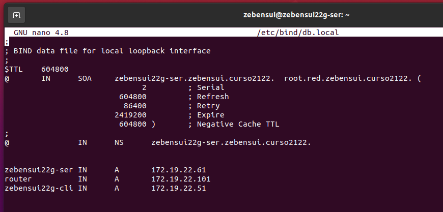
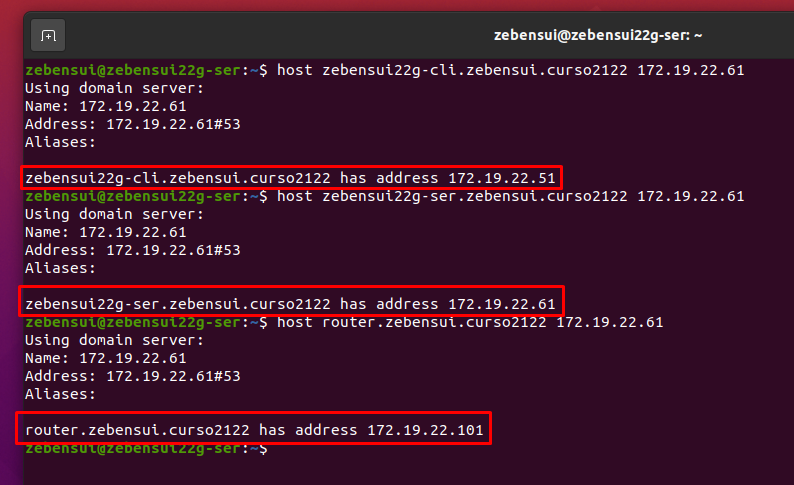
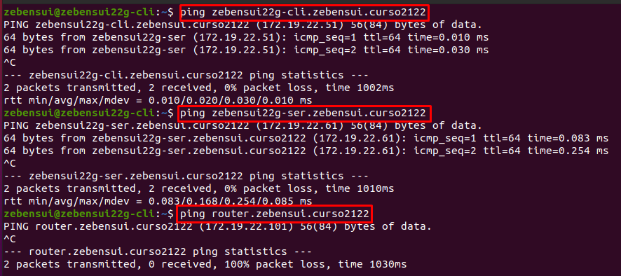
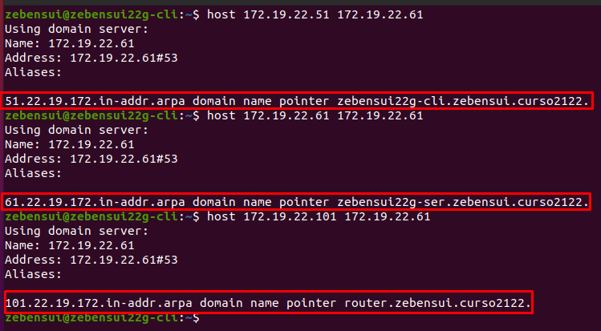

# Informe DNS Linux - Zebensui Lorenzo Esquivel

  En esta ocasión lo que vamos a hacer es configurar el servicio DNS en máquinas Linux, Ubuntu 20 en mi caso.

  1. Nos instalamos el servicio bind9.

  

  

  2. Aquí hay que prestar atención porque si no funciona te vas a meter horas buscando el porque. Lo que tenemos que hacer es decirle a nuestra máquina que nuestro DNS a partir de ahora es la propia máquina que va a actuar de servidor, para ello tenemos que modificar el archivo /etc/resolv.conf añadiéndole nuestra IP el problema es que ese archivo es un enlace que va a restaurarse cada vez que reiniciemos el servicio, por lo que tenemos que ir al archivo real y modificarlo desde ahí, esto hará que no se cambie cuando reiniciemos el servicio pero si la máquina (cosa que no debería pasar)

  

  

**IMPORTANTE** El archivo /etc/hosts tiene que tener nuestra IP y nombre porque si no nada de lo que seguiremos haciendo funcionara correctamente y nos dará todo el rato este error:

  

Así que tenemos que tener el /etc/hosts de la sigueinte forma:

  

  Aparte también tenemos que especificarle al adaptador de red el DNS

  

  3. Vamos a configurar los reenviadores, para ello creamos primero una copia del archivo original y luego los añadimos

  

  

  4. Comprobamos que funcionan desde el servidor y desde el cliente

  

  

  5. Vamos a crear el archivo que contiene la información de las zonas de búsqueda directa e inversa. Antes que nada hacemos la copia de seguridad y luego modificamos especificando el nombre de las zonas, el tipo y la ruta donde se encuentran los ficheros de configuración que modificaremos luego

6. Ahora creamos los ficheros de configuración de ambas zonas, teniendo mucho cuidado de la sintaxis ya que el comando que nos la verifica nos puede decir que esta bien cuando realmente no lo esta porque se nos colo una coma en vez de un punto, por ejemplo, así que mucho ojo y cuidado

7. Lo único que nos queda es comprobar la resolución de nombres de ambas zonas tanto en el servidor como en el cliente

## Servidor

## Cliente

Aquí solo tenemos que añadir el DNS al adaptador de red y listo.

