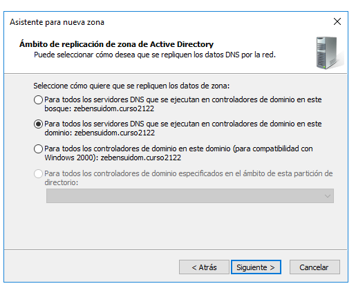
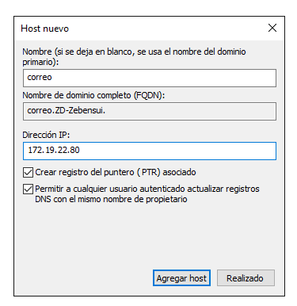

 # Informe DNS Windows - Zebensui Lorenzo Esquivel

En este caso vamos a instalar y configurar el servidor de nombres (DNS) en una máquina Windows Server 2016

Para ello lo primero es instalarlo mediante le asistente. Como siempre nos vamos a la parte de Agregar Roles y Características y seleccionamos el servicio DNS aunque lo más probable es que ya lo tengamos instalados como es mi caso, puesto que se instala cuando promovemos el AC a controlador de dominio.

 

Nos vamos a la parte de herramientas y lo abrimos.

# Zona de búsqueda Directa

Lo que vamos a hacer ahora es crear una zona de búsqueda directa en nuestro servidor, para ello clicamos en zona de búsqueda directa y le damos a Zona nueva...

Se nos abrirá el asistente que nos va a ser de gran ayuda a la hora de configurarlo todo.

Ahora vamos a ir poco a poco seleccionando las opciones que queramos. En el primer caso nosotros vamos a crear una zona principal.

Esta opción nos da igual ahora mismo porque no tenemos otro servidor DNS en este dominio pero igualmente es bueno marcarla por si en algún futuro se planea crear otro.

Sencillamente elegimos el nombre que queramos, a poder ser uno sencillo porque luego nos vamos a cansar de escribirlo.

Escogemos como queremos gestionar las actualizaciones, en mi caso escogí la opción que esta a medio camino entre comodidad y seguridad.

Con esto hemos finalizado la creación de la zona directa.

Comprobamos que se creo correctamente.

# Zona de búsqueda Inversa

Ahora vamos a por la zona de búsqueda inversa que realmente se crea de la misma forma.

Las primeras opciones que nos muestra son las mimas que antes por lo que las dejamos iguales.

Ahora elegimos para que clase de IP va a ser la zona. En nuestro caso IPv4.

Escogemos le rango de IP de la zona y el nombre se pondrá solo.

Lo mismo que antes.

Y con esto hemos terminado la Zona Inversa.

# Reenviadores

Para los reenviadores nos vamos a nuestro máquina dentro del DNS, le damos click derecho Propiedades, Reenviadores

Aquí añadimos las IP de los servidores DNS a los que queremos que nuestro servidor haga peticiones cuando le pregunten por una IP que el no conozca. Nota: No puse la puerta de enlace porque no estoy en la red de clase y por ello no podía validarla.

# Server Cache

Ahora vamos a configurar el server como Cache. Para ello tenemos que tener la configuración de red estática de la siguiente forma:

Y el cliente así:

Ahora comprobamos (con el comando nslookup /displaydns) desde el servidor buscando una web y luego desde el cliente buscando esa misma web para ver que nos da lo mismo que en el servidor pero saliendo por él.

Server:

Cliente:

# Server Master

Vamos a empezar a añadir nuevos host al servicio DNS. El funcionamiento para todos es el mismo, le damos click derecho en la zona que hemos creado y seleccionamos le tipo de registro que queremos, para el primero sera un Alias CNAME del servidor en el que estamos

Tendremos que ponerle el nombre que queramos y seleccionar hacía que máquina apunta.

Para todos los siguientes lo hacemos de la misma forma solo que en este caso es un host nuevo, osea un registro A

Importante marcar en todos "Crear registro PTR asociado" para que se cree en la zona inversa de forma automática

Para el de correos primero creamos el registro host (A) y creamos un MX que apunte a él.

Así nos queda:

Para el de correos primero creamos el registro host (A) y creamos un MX que apunte a él.

Seguimos el procedimiento como antes

Así nos queda:

Y la zona inversa:

Antes de seguir a hacer las comprobaciones vamos a asegurarnos de que el servidor DNS registra a nuestro cliente

# Comprobaciones

Lo que nos falta es comprobar que se resuelven todos los registros que hemos creado desde el servidor y desde el cliente.

Servidor:

Cliente:

Nslookp desde el cliente hacia el exterior:

