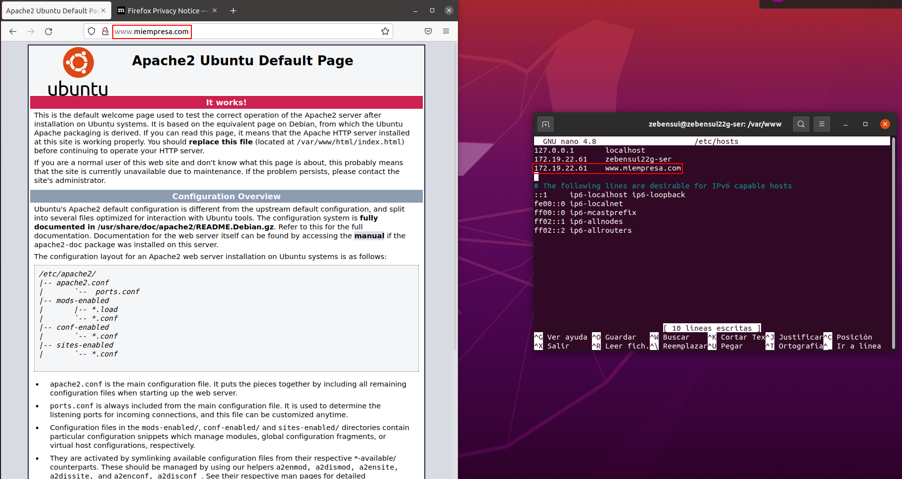
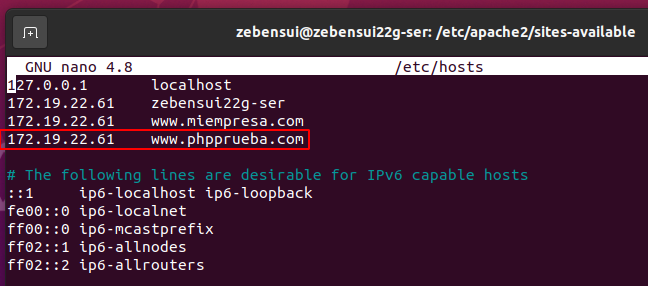
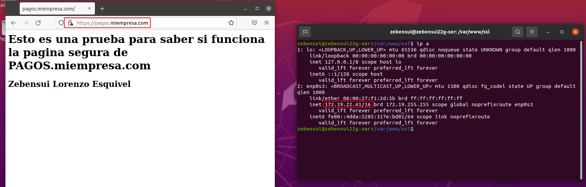

# Informe ISS Linux - Zebensui Lorenzo Esquivel

1. Lo primero que hacemos es instalar apache y comprobar que funciona correctamente, tanto con la IP como con el nombre.

2. Comprobamos las carpetas de apache y lo reiniciamos.

3. Nos instalamos le php.

4. Ahora vamos a crear el sitio web con el php por defecto para comprobar que te funciona perfectamente.

5. Vamos a crear otro sitio, empleados.miempresa.com para comprobar que todo funciona correctamente.

6. Creamos el sitio seguro pagos.miempres.com Para ello primero generamos el certificado.

