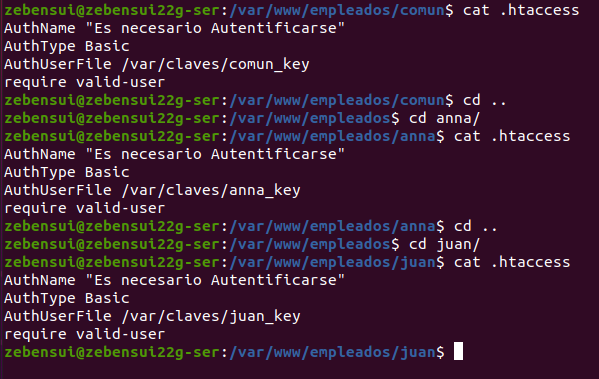

# Informe ISS Linux - Zebensui Lorenzo Esquivel

1. Lo primero que hacemos es instalar apache y comprobar que funciona correctamente, tanto con la IP como con el nombre.

2. Comprobamos las carpetas de apache y lo reiniciamos.

3. Nos instalamos le php.

4. Ahora vamos a crear el sitio web con el php por defecto para comprobar que te funciona perfectamente.

5. Vamos a crear otro sitio, empleados.miempresa.com para comprobar que todo funciona correctamente.

6. Creamos el sitio seguro pagos.miempres.com Para ello primero generamos el certificado.

7. A contnuación vamos a configurar el acceso a los sitios web para determinado usuarios. Lo primero es irnos al fichero de configuración del sitio y activar la siguiente opción.

8. Lo sigueinte es crear las carpetas de cada usuario y añadir un index para cada uno.

9. Ahora generamos las claves para cada usuario y las metemos en su ficheros .htpaccess

10. Comprobamos el acceso a los sitios con cada usuario.

11. Nos instalamos mysql, phpmyadmin y comprobamos que funcionan correctamente.

12. Creamos la base de datos y el usuario que usaremos luego para crear el cms.

13. Ahora vamos a crear el sitio en el que alojaremos wordpress.

14. Accedemos al y nos mostrara lo siguiente:

15. En caso que no nos deje tenemos que hacer lo que nos indica, que es copiar el código dentro del fichero que nos dice.

16. Y por último vemos que nos funciona y comprobamos haciendo una entrada de prueba en la página.

!

