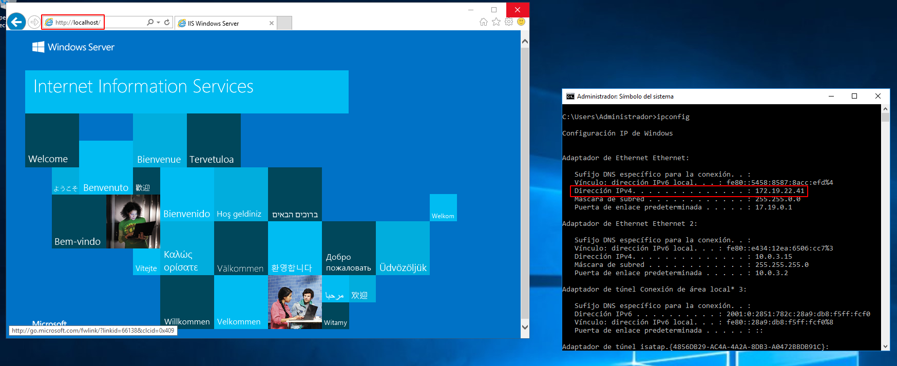
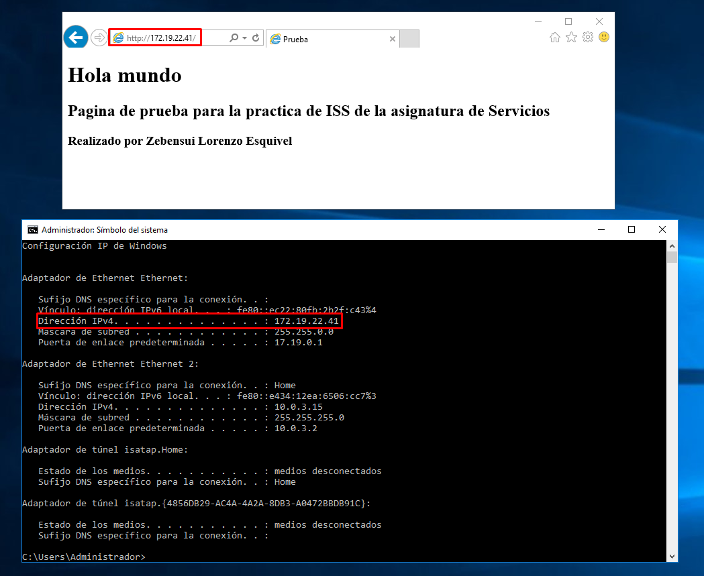
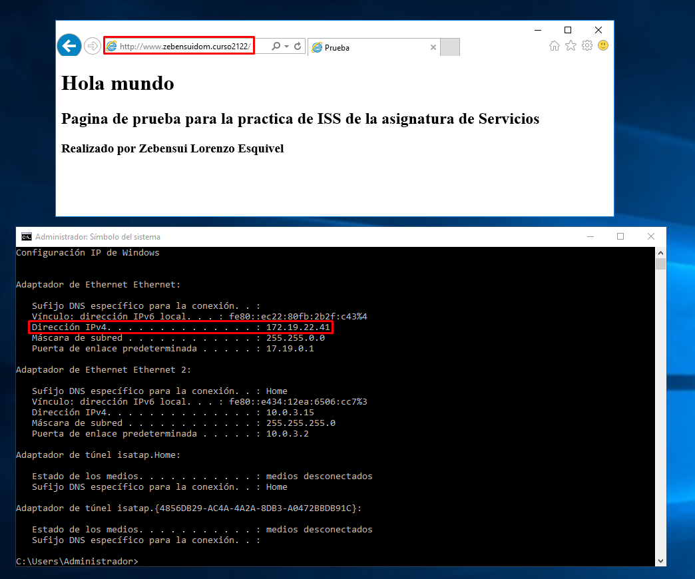
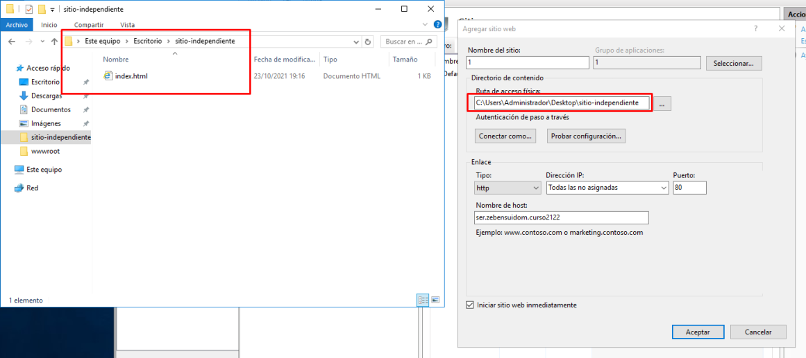

# Informe Servicio Web - Zebensui Lorenzo Esquivel

En esta práctica vamos a configurar el servidor web en windows a través de tres practicas que veremos a continuación:

## Primera práctica

Lo primero, por supuesto, es instalarnos el servicio IIS con las características que se nos indica.

Ahora comprobamos que el servicio funciona accediendo a la IP del servidor desde el navegador, tanto en el servidor y el cliente.

Lo siguiente es añadir registros al DNS para entrar a este misma página mediante el nombre que escojamos.

Lo siguiente que haremos es modificar el index de la página por defecto y comprobar que podemos entrar en ella

Ahora vamos a crear dos páginas con algo más de información, una imagen y una navegación sencilla entre ellas.

Comprobamos que todo funciona desde el servidor y desde el cliente.

## Segunda práctica

En esta práctica vamos a crear un sitio web independiente al que vimos antes que era el sitio por defecto del servidor web.

Lo primero es crear el directorio donde vamos a alojar los archivos de la página

Para crear el sitio nos vamos al servicio IIS, le damos click derecho y en Agregar Sitio

Ahora tenemos que darle un nombre, especificar la ruta donde están los ficheros de la página, la IP que vamos a usar y el nombre que vamos a poner para entrar al sitio. Tiene que ser dentro de tu dominio para luego ir al DNS y crear el alias dentro del mismo.

Importante: Tenemos que meter al grupo IUSR dentro de la carpeta en la que tenemos nuestra página porque si no no nos dejara verla. Para ello nos vamos a donde indica la imagen y le damos al apartado de Seguridad, Agregar.

Comprobamos que todo funciona desde el servidor y desde el cliente.

## Tercera práctica

En esta ultima tenemos que crear varios directorios virtuales dentro de nuestro sitio y configurarlos para que muestren una página diferente cada uno.

Nos vamos al sitio creado anteriormente y le damos click derecho Agregar Directorio virtual...

Solo tenemos que darle un nombre y especificar la ruta donde se encuentra.

Solo nos queda ir a los tres directorios virtuales y comprobar que funcionan desde el servidor y desde el cliente

