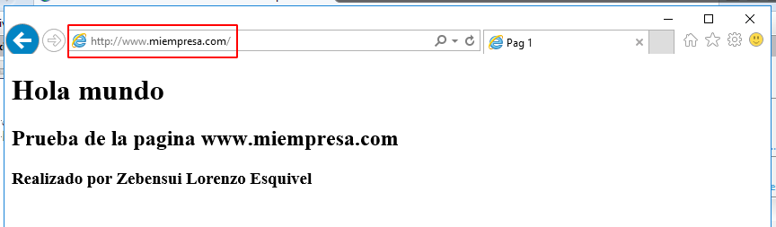
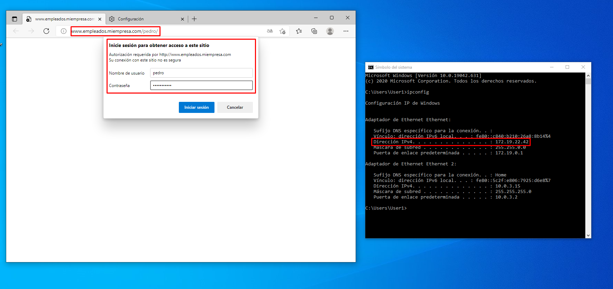

# Informe Servidor Web avanzado Windows - Zebensui Lorenzo Esquivel

Informe Esta práctica tiene dos partes. En la primera vamos a crear certificados para una página web, el primero sera autofirmado y el otro lo generaremos nosotros, y en la segunda vamos a crear carpetas y darles permisos a ciertos usuarios para poder entrar en ellas validandonos.

## Ceritifcado autofirmado.

Creamos el sitio web y configuramos el DNS para poder acceder a él desde el navegador con el nombre que escojamos.

Ahora vamos a crear un subdominio dentro de la página anterior y vamos a añadirle el certificado autofirmado.
Para ello lo tenemos que crear primero, y esto lo hacemos desde el panel de control del servicio IIS tal y como se muestra a continuación:

Creamos la página y comprobamos (desde el servidor y el cliente) que se accede a ella con el protocolo https y que sin él nos muestra la página por defecto.

## Ceritifcado generado.

Ahora nos vamos a la parte donde creamos el certificado autofirmado anteriormente pero en este caso lo vamos a generar nosotros por lo que tenemos que configurarlo con los siguientes datos:

**Nos instalamos antes el OpenSSL para poder generarlo**

Los datos que queramos:

El servicio criptográfico y la longitud de la clave:

Y el lugar donde la vamos a guardar:

Nos vamos a la carpeta donde nos genero la clave y vamos a introducir los siguientes comandos en el orden que su muestra, esto nos generara tres archivos más.

Ahora solo tenemos que ir a completar la generación del certificado con el último documento que hemos generado.

Creamos el sitio con el certificado que acabamos de crear y comprobamos (desde el servidor y el cliente) que funciona.

## Carpetas y permisos.

Creamos el sitio web y dentro ponemos una carpeta para cada usuario que queramos que se conecte, y una para todos a la que llamaremos común.

Vamos al servidor IIS y deshabilitamos la autenticación anónima y habilitamos la básica.

Creamos los usuarios correspondientes y los metemos en el grupo empleados,

Solo nos queda dejar las carpetas con los permisos que se nos indica.

Vamos a comprobar desde el cliente que las páginas con accesibles y que nos piden nuestros credenciales.

