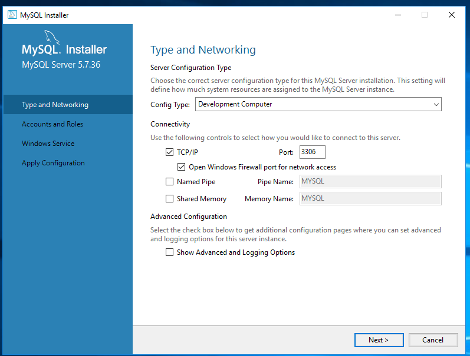
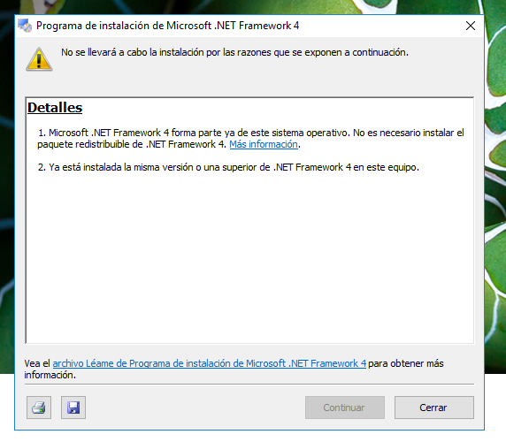
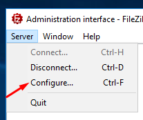
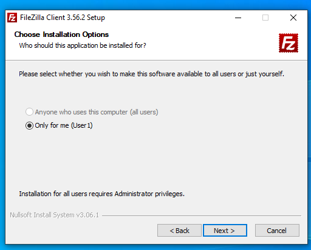
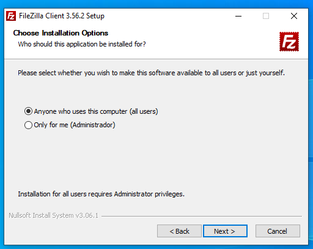
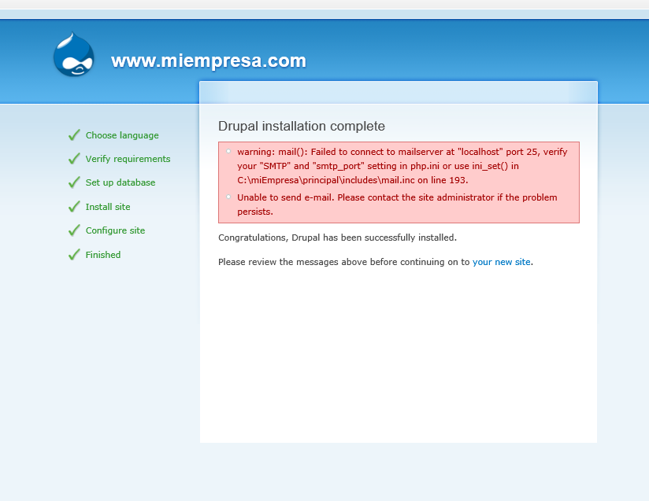

# Informe ISS tercera parte - Zebensui Lorenzo Esquivel.

En esta ocasión vamos a montar un servicio de hosting dentro de nuestra página tal y como lo haríamos si contratáramos un servicio de host por internet para dar de alta nuestra página.

Para ello necesitamos PHP, MySQL, phpMyADmin, C++ y tenemos que tener mucho cuidado con las versión ya que dan problemas de compativilidad.

| Programa | Versión     |
| :------------- | :------------- |
| PHP       | 5.3.9       |
| MySQL     | 5.5.60      |
| phpMyAdmin     | 4.4.15       |

1. Vamos a instalar en primer lugar el PHP.

Marcamos la primera opción.

Comprobamos que se instalo correctamente en nuestro sitio web después de haber añadido el index.php a nuestra web.

2. Ahora vamos con instalación del MySQL

**IMPORTANTE: LAS SIGUIENTES CAPTURAS SON DE LA VERSIÓN 5.5.30 Y NO DE LA 5.5.60 QUE NO ES LA VERSIÓN QUE NOS TENEMOS QUE INSTALAR PERO SON LAS PRIMERAS QUE HICE Y REALMENTE PARA TODAS LAS VERSIONES TENEMOS QUE SEGUIR LOS MISMOS PASOS**

3. Instalamos el C++ entre medio de la instalación de MySQL y luego seguimos con ella.

4. Intentamos instalar .NET Framework 4 aunque lo más probable es que nos diga que ya esta instalado.

5. Ahora hacemos lo de siempre y vamos a crear el sitio web que tendrá alojado el phpMyAdmin.

6. Ahora tenemos que descargarnos el phpMyAdmin y descomprimir todo el contenido de su carpeta dentro del sitio que acabamos de crear, y si todo funciona correctamente y las versiones son compatibles nos debería quedar tal que así.

7. En el servidor ya solo nos queda instalar el Filezilla Server.

8. Una vez instalado nos queda crear el usuario para luego conectarnos desde el cliente y crear el alias en el DNS.

9. Ahora nos vamos al cliente y comprobamos que nos conecta con el sitio phpMyAdmin.

10. Nos instalamos el cliente de Filezilla.

11. Comprobamos al conectividad entre cliente servidor con Filezilla.

12. Nos instalamos drupal en el cliente y lo pasamos a la carpeta del sitio www.miempresa.com del servidor.

13. Creamos la base de datos y el usuario de la misma desde el phpMyAdmin.

14. Nos vamos a la carpeta default dentro de sites de nuestro sitio web y clonamos el archivo que esta dentro cambiandole el nombre a settings

15. Vamos a nuestro sitio web y ahora si podemos seguir con la instalación del Drupal.

16. Lo último que tenemos que hacer es personalizar nuestro sitio con Drupal.
Para ellos vamos a hacer varias cosas, la primera es cambiar el idioma a Español.
Para ello tenemos que instalar el modulo Locale, seleccionar el idioma Español por defecto, descargarnos el paquete de Español e importarlo.

17. Nos instalamos el modulo para tener todos los idiomas disponibles.

18. Instalamos varios temas y cambiamos el que tenemos.

19. Ya solo nos queda crear el contenido de las páginas y ponerles un menú.

