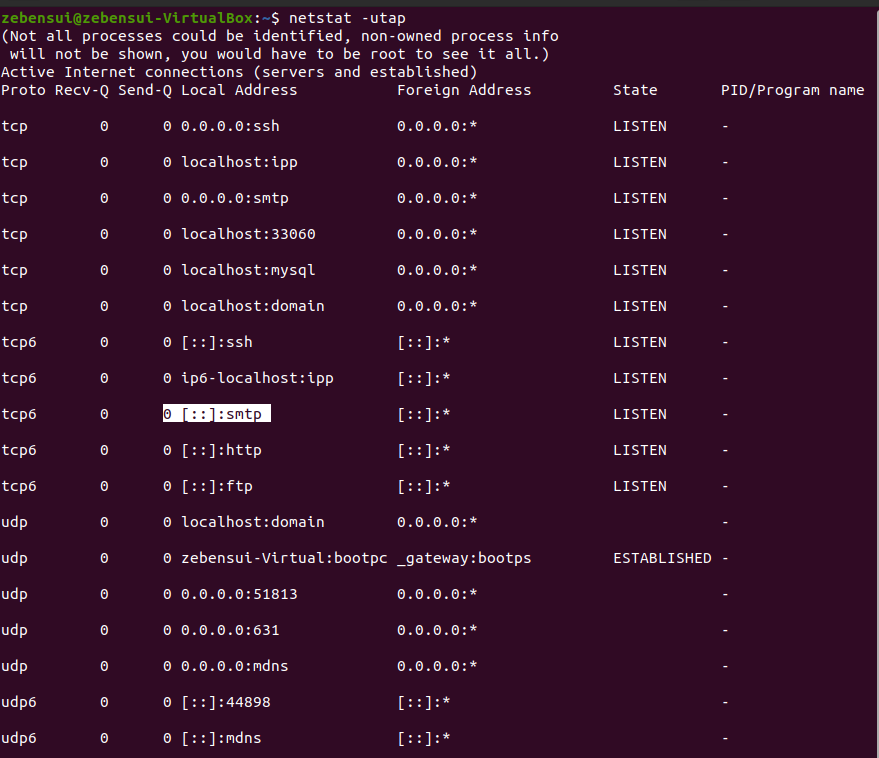
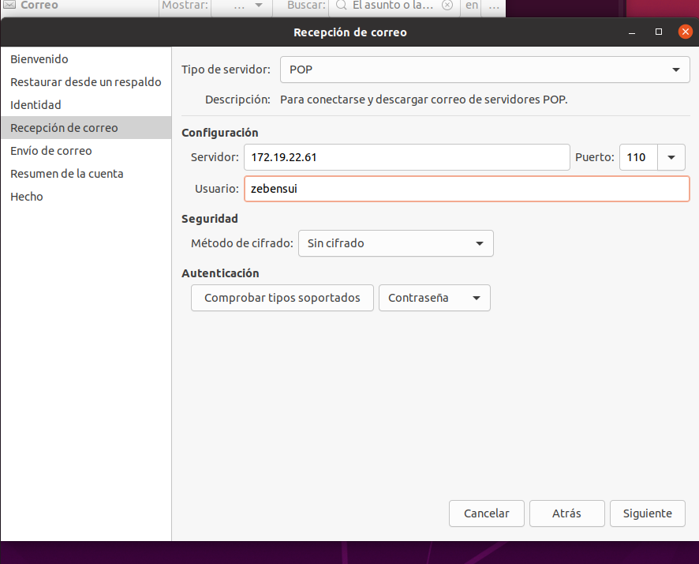

# Servicio de Correo en Linux - Zebensui Lorenzo Esquivel

Vamos a configurar un servicio de correo en nuestra máquina Ubuntu 20.

## SMTP

Lo primero que hacemos es instalar el servidor Postfix que nos distribuirá el servicio SMTP.
Cuando lo estemos instalando seleccionamos "Internet Site" y le ponemos el nombre de dominio que queramos.


Comprobamos que esta en funcionamiento y con sus respectivos puertos funcionando.




Vamos a realizar una prueba de envío entre dos usuarios del sistema mediante telnet. Luego vamos a la carpeta /var/spool/mail/zebensui y comprobamos que se a enviado y recibido correctamente.


Ahora nos vamos al cliente e instalamos el Evolution


Lo configuramos de la siguiente manera

1. Ponemos el nombre de nuestro usuario, que es el nombre normal del usuario con el dominio que configuramos a la hora de instalarnos el Postfix 


2. Lo dejamos sin nada.


3. Le especificamos la IP del servidor, el puerto y no le ponemos método de cifrado.


4. Nos queda tal que así:


5. Tenemos que hacer lo mismo con todas las cuentas con la que queramos hacer envíos.


Vamos a hacer la prueba de envío.


## IMAP

Nos instalamos el IMAP con el comando:

```
sudo apt install dovecot-imapd
```
Y comprobamos los puertos


Para usar el IMAP nos vamos a descargar el SquirrelMail que en la última versión de Ubuntu lo tenemos que hacer que pillar de una página web, descomprimirlo y darle permisos porque ya no esta en los repositorios. Lo hacemos con estos comandos:

```
wget https://sourceforge.net/projects/squirrelmail/files/stable/1.4.22/squirrelmail-webmail-1.4.22.zip

unzip squirrelmail-webmail-1.4.22.zip

sudo mv squirrelmail-webmail-1.4.22 /var/www/html/

sudo chown -R www-data:www-data /var/www/html/squirrelmail-webmail-1.4.22/

sudo chmod 755 -R /var/www/html/squirrelmail-webmail-1.4.22/

sudo mv /var/www/html/squirrelmail-webmail-1.4.22/ /var/www/html/squirrelmail
```

Para configurarlo ponemos el siguiente comando que nos abrirá los ajustes

```
sudo perl /var/www/html/squirrelmail/config/conf.pl
```


Una vez dentro lo primero que hacemos es cambiar el nombre del dominio. Pulsamos el 2, luego el 1 y añadimos el dominio que pusimos al principio en Postfix


Ahora nos volvemos al menú de antes, pulsamos el 4 y tenemos que cambiar las dos primeras rutas que nos pone y la opción 11 de false a true.


Con esto es suficiente. Nos vamos al navegador ponemos localhost/squirrelmail y deberíamos entrar a la pantalla para poner nuestros credenciales.


Nos vamos al cliente, añadimos la dirección del servidor al archivo /etc/hosts con el nombre con el que queramos entrar y nos debería de volver a salir la pantalla para meter los credenciales.


Ahora vamos a hacer la prueba de envío.


## POP3

Nos instalamos el POP3 con el comando:

```
sudo apt install dovecot-pop3d
```
Y comprobamos los puertos y el servicio


Ahora nos tenemos que ir otra vez al Evolution y configurarlo igual que antes pero añadiendo el POP3 de la siguiente forma:




Por último hacemos una prueba de envío, y debería borrarse el mensaje el problema es que en las últimas versiones del POP3 eso ha cambiado y el mensaje no desaparece por lo que se nos queda igual que antes pero por lo menos sabemos que si envía todo correctamente.


