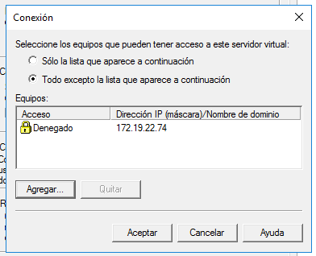
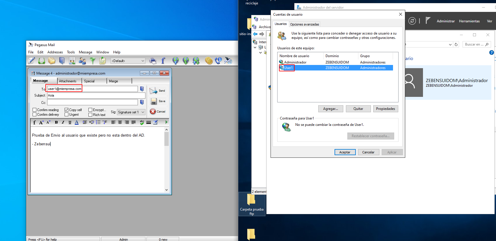

# Informe Correo Windows - Zebensui Lorenzo Esquivel

1. Vamos a instalar y configurar el servicio de correo electrónico en nuestro servidor de Windows.

Para ello lo primero que tenemos que hacer es instalar la característica SMTP desde los roles del servidor.

2. Una vez instalado vamos a Herramientas y seleccionamosAdministrador de aplicaciones (IIS) 6.0.

Cuando estemos dentro vamos a configurar el servidor de correo a través de las propiedades.

3. En la primera ventana que nos sale nada más darle a propiedades vamos a establecer como IP todas las asignadas (aunque ponga que no son todas realmente si lo son porque esta mal) limitamos el número de conexiones a 50 y habilitamos el registro en formato W3c, diario y en una carpeta en concreto.

4. Nos vamos a la pestaña de acceso y le establecemos una inventada, pero dentro de la red, en la parte de conexiones y restricciones de retransmisión

5. También activamos la autenticación anónima.

6. Le damos a aceptar y comprobamos que se ha creado el dominio correctamente.

7. Ahora creamos un alias que apunte a ese dominio que sera el nombre del servicio de correo. Osea lo que va detrás del @.

8. Comprobamos la carpeta C:\Inetpub\mailroot.

9. Ahora nos vamos al DNS, creamos el registro de tipo Correo y comprobamos que funciona.

10. Para seguir con las comprobaciones nos tenemos que ir al cliente descargar e instalar Pegasus Mail.

11. Para configurarlo tenemos que poner el nombre de nuestra cuenta de correo, en nuestro caso es el nombre de un usuario que tengamos creado en el dominio del servidor.

12. Esta parte nos la saltamos porque no tenemos nada de POP3 instalado.

13. Ponemos la IP del servidor.

14. Lo dejamos como esta.

15. Ahora nos queda hacer todas las comprobaciones de envió de correos.

- La primera es hacia un usuario que existe en el AD

- La segunda a un usuario que está en el sistema pero no en el AD

- La tercera a un usuario que no existe.

- La última a mi cuenta de correo personal.

