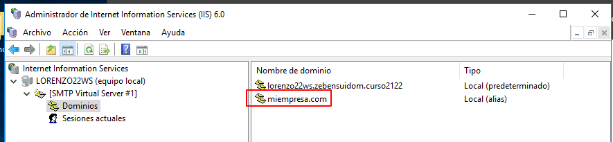
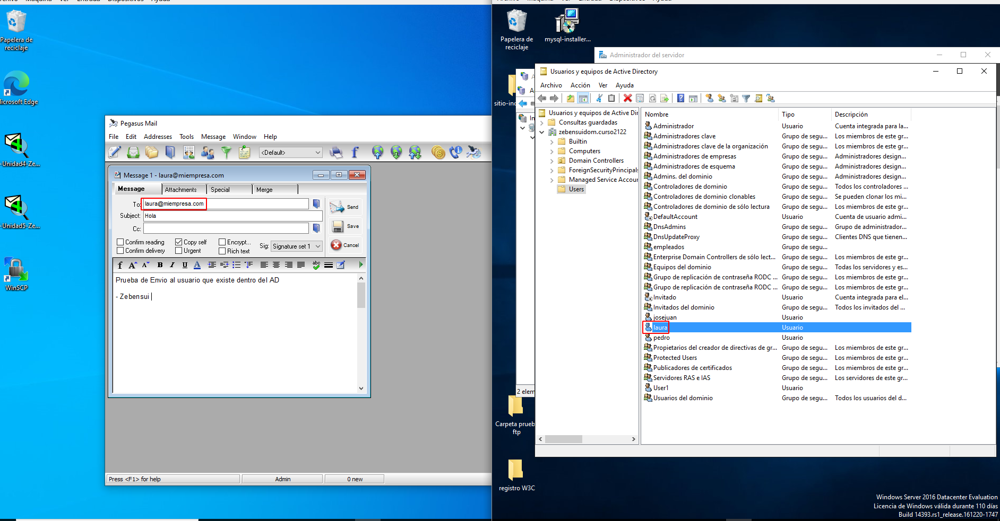
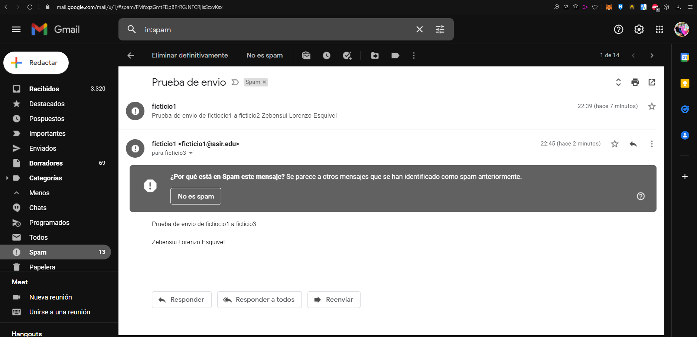

# Informe Correo Windows - Zebensui Lorenzo Esquivel

# SMTP (IIS 6.6)

Vamos a instalar y configurar el servicio de correo electrónico en nuestro servidor de Windows.

Para ello lo primero que tenemos que hacer es instalar la característica SMTP desde los roles del servidor.

Una vez instalado vamos a Herramientas y seleccionamosAdministrador de aplicaciones (IIS) 6.0.

Cuando estemos dentro vamos a configurar el servidor de correo a través de las propiedades.

En la primera ventana que nos sale nada más darle a propiedades vamos a establecer como IP todas las asignadas (aunque ponga que no son todas realmente si lo son porque esta mal) limitamos el número de conexiones a 50 y habilitamos el registro en formato W3c, diario y en una carpeta en concreto.

Nos vamos a la pestaña de acceso y le establecemos una inventada, pero dentro de la red, en la parte de conexiones y restricciones de retransmisión

También activamos la autenticación anónima.

Le damos a aceptar y comprobamos que se ha creado el dominio correctamente.

Ahora creamos un alias que apunte a ese dominio que sera el nombre del servicio de correo. Osea lo que va detrás del @.

Comprobamos la carpeta C:\Inetpub\mailroot.

Ahora nos vamos al DNS, creamos el registro de tipo Correo y comprobamos que funciona.

Para seguir con las comprobaciones nos tenemos que ir al cliente descargar e instalar Pegasus Mail.

Para configurarlo tenemos que poner el nombre de nuestra cuenta de correo, en nuestro caso es el nombre de un usuario que tengamos creado en el dominio del servidor.

Esta parte nos la saltamos porque no tenemos nada de POP3 instalado.

Ponemos la IP del servidor.

Lo dejamos como esta.

Ahora nos queda hacer todas las comprobaciones de envió de correos.

- La primera es hacia un usuario que existe en el AD

- La segunda a un usuario que está en el sistema pero no en el AD

- La tercera a un usuario que no existe.

- La última a mi cuenta de correo personal.

Ahora vamos a establecer la autenticación básica de Windows desde el IIS 6.6

Lo que tenemos que hacer en el Pegasus desde el cliente es lo que se ve a continuación, activar el logearte con SMTP, poner el usuario y la contraseña y activar el STARTTLS.

Con esto se supone que debería funcionar pero en mi caso me salio este error y no supe como solucionarlo la verdad porque le pregunte a mis compañeros que le funcionaba y lo tenían como yo.

# hMailServer

Ahora vamos a empezar a configurar el hMailServer para esto tenemos que desinstalar primero el SMTP.

Una vez descargado empezamos con la instalación.

Le especificamos la ruta

Le decimos que queremos la instalacióncompleta

Queremos que use su base de datos

Ponemos la contraseña

Nos dira que tenemos que instalar una dependencia para que funcione el programa, que es Microsoft.NET Framework. Lo puedes descargar con el programa que lo hace de forma automática o la descargar tu de forma manual antes de instalar el hMailServer.

Ahora lo abrimos, seleccionamos el usuario y entramos con la contraseña que pusimos antes.

Lo primero que tenemos que hacer es crear los dominios, para ello nos vamos a Domains y le damos a Add

Le especificamos la carpeta en la que se guardaran todos los backups y seleccionamos que guarde los mensajes.

Ahora nos vamos al dominio, le damos en Accounts y Add para crear los usuarios.

El primero, que es ficticio1, tendrá un máximo de 2GB en el servidor para almacenar sus correos.

Al segundo, que es ficticio2, le ponemos el nombre y apellidos

Al tercero, que es ficticio3, le configuramos la auto respuesta.

Y al ultimo, que es ficticio4, le decimos que reenvíe todos los correos al primer usuario.

Ahora nos vamos al DNS y creamos las entradas correspondientes.

Vamos a configurar el servidor un poco a nuestro gusto.

Creamos un rango de IPs, es decir solo los ordenadores que se encuentren en este rango podrán usar el servidor.

Le especificamos que mande una copia de todos los correos enviados a mi correo personal.

Le cambiamos el puerto al IMAP

Vamos a poner mensajes de bienvenida en los tres protocolos.

Para comprobarlos necesitamos descargar el telnet.

Ahora nos vamos a la consola de comandos y escribimos telnet localhost y el puerto al que nos queremos conectar.

Por último vamos a desactivar el Auto-Ban por si nos equivocamos a la hora de entrar con el usuario que no nos bloquee la cuenta.

Nos descargamos el cliente Thunderbird y le especificamos lo siguiente:

Nos dara un aviso, le damos que lo si

Y ya lo tenemos, solo tenemos que hacer esto con todos los usuarios.

Ahora vamos a empezar a comprobar el envió y recepción de correos.

- De ficitico1 a ficticio2

Vemos que si se manda la copia a mi correo tal y como le dijimos.

- De ficitico1 a ficticio3

Vamos que si se envía la auto respuesta de ficticio3 tal y como la configuramos.

- De ficitico1 a ficticio4

Vemos que automáticamente el correo que enviamos a ficticio4 se nos envía a ficticio1 tal y como le especificamos.

Lo último que nos queda es crear una lista de distribución, para ello nos tenemos que ir al dominio creado.

Le ponemos nombre, la habilitamos y le decimos que sea publica para que acceda cualquiera.

Le añadimos los mienbros de miempresa.com

El problema viene que te deja entrar con la cuenta de empleados pero te pide contraseña cuando no la tiene

Aunque te deja enviar correos pero no llegan a ninguna parte.

