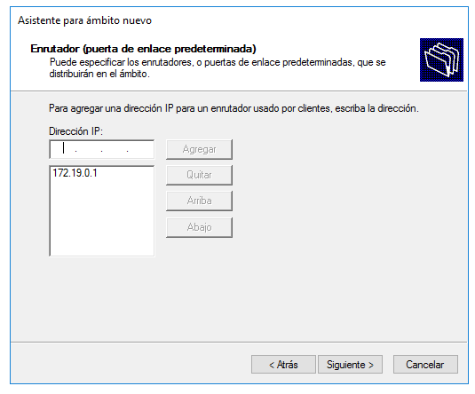
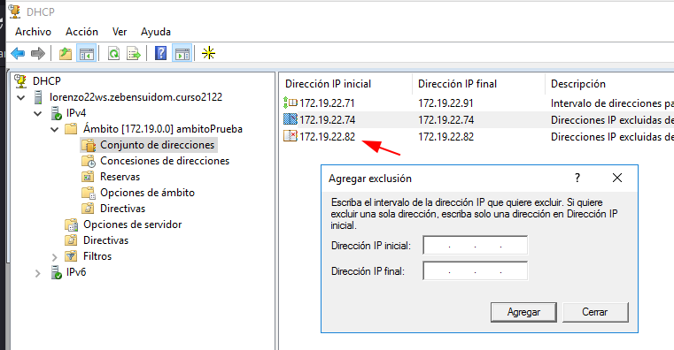

# Informe DHCP en Windows - Zebensui Lorenzo Esquivel

En esta ocasión vamos a ver como instalar y configurar el servicio DHCP
 en Windows Server 2016. Este servicio es el que se encarga de suministrar IPs
 de forma automática a los clientes, facilitando de esta forma el trabajo del Administrador.

 **Importante** En este caso vamos a poner las dos máquinas en red Interna ya que estamos en un periodo de prueba y no queremos que de problemas.

1. Lo primero que tenemos que hacer es instalar el servicio y para ello nos vamos a Agregar roles y Características dentro del AC

  

2. A continuación lo que tenemos que hacer es instalar el DHCP
 con el asistente, cosa que se hace de forma bastante automática, solo tenemos que seleccionarlo y añadir sus características.

   

   

   

   

3. Le damos al triángulo amarillo que nos sale en la parte de arriba para terminar
 de configurar el servicio.

  

  

  

  

4. Ahora nos vamos a la parte de Herramientas y seleccionamos el DHCP.

  

5. Una vez dentro del servicio lo que tenemos que hacer es darle click derecho en la parte de IPv4 y crear un Ámbito nuevo... Y vamos a configurarlo poco a poco con el asistente. (Si se nos olvida poner algo o lo hacemos mal no pasa nada porque luego vamos a poder agregar o quitar lo que queramos)

  

6. Lo primero que nos pide es poner el nombre y descripción del ámbito.

  

7. Aquí ya empieza lo que nos interesa. Nos pide el rango, es decir de que IP hasta que IP va a suministrar nuestro servidor a los clientes. En mi caso le puso 20 IPs, desde la 71 hasta la 91.

  

8. Lo siguiente que nos pide es decirle que IPs (dentro del rango dado anteriormente por supuesto) queremos que no se las de  ningún equipo. Podemos no poner nada porque queremos que de todas las IPs, podemos poner un rango, de por ejemplo 5 IPs excluidas, o en mi caso solo excluí una, que luego cambie de todas formas.

  

9. Ahora le especificamos cuanto tiempo quremos que cada cliente tenga la IP que le asigna el DHCP. Si el PC esta encendido cuando acaba este tiempo no se la va a quitar de todas formas.

  

10. En este momento podemos acabar aquí con el asistente o podemos seguir configurando las Opciones del Ámbito que veremos a continuación.

  

11. Ahora nos pide que le digamos cual es la puerta de enlace que va a darle a todos los equipos que entren dentro del ámbito.

  

12. Lo siguiente es ponerle el servidor DNS que van a tener todos los equipos que se conecten al ámbito

  

13. Por ultimo nos pregunta que si queremos activar el servicio WINS, cosa que yo deje en blanco porque no me interesa.

  

14. Con esto ya estaría terminada la configuración del ámbito.

  

Ahora nos vamos al cliente y comprobamos que esta en DHCP y nos da una IP dentro del rango especificado (probablemente sea la primera)

  

  

15. En mi caso quería añadir una reserva. Es decir que a mi equipo cliente siempre se le guarde y se le asigne la misma IPs dentro de ese rango. Para eso necesitamos saber la MAC del equipo para poder asociarle la IP que queremos que tenga siempre.

  

16. Sabiendo la MAC lo que tenemos que hacer es irnos a la parte de Reserva dentro del ámbito y especificar cual es la IP que queremos que se le asocie.

  

Comprobamos que la IP de reserva se asignó correctamente.

  

17. Bien ahora vamos a comprobar si sirve la exclusión de IPs. Para ello vamos a aprovechar lo siguiente: Cuando nosotros reservamos la IP 82 para el equipo y luego quitamos la reserva, el servidor le sigue dando esa porque no hay más equipos que pidan IPs por lo que vamos a excluirle esa para que no se la de más y vuelva a darle otra dentro del ámbito. Para ello nos tenemos que ir al ámbito, click derecho, agregar exclusión, y pones la IP que queremos excluir como antes.

Por último solo me queda explicar que si queremos cambiar la configuración de la puerta de enlace y DNS que da el ámbito por defecto, entre otros muchos parámetros, nos podemos ir al apartado de Opciones del Ámbito. Y si por algún casual tenemos varios ámbitos y solo queremos cambiar algo en uno y que los demás del server se queden con otros ajustes podemos hacer lo mismo dentro de Opciones de Servidor, que funciona de la misma manera pero a nivel de máquina, en mi caso como lo configure con el asistente antes y solo tengo un ámbito lo dejo como esta.

