# Informe DHCP en Ubuntu - Zebensui Lorenzo Esquivel

En esta ocasión vamos a ver como instalar y configurar el servicio DHCP en Ubuntu 20.04. Este servicio es el que se encarga de suministrar IPs de forma automática a los clientes, facilitando de esta forma el trabajo del Administrador.

**Importante:** En este caso también tenemos que tener las máquinas en red interna ya que estamos en un entorno de prueba y no queremos que de problemas.

1. Lo primero es instalar el servicio, para ello abrimos una terminal y ejecutamos el comando de instalación propio junto al nombre del servicio que en este caso es isc-dhcp-server.

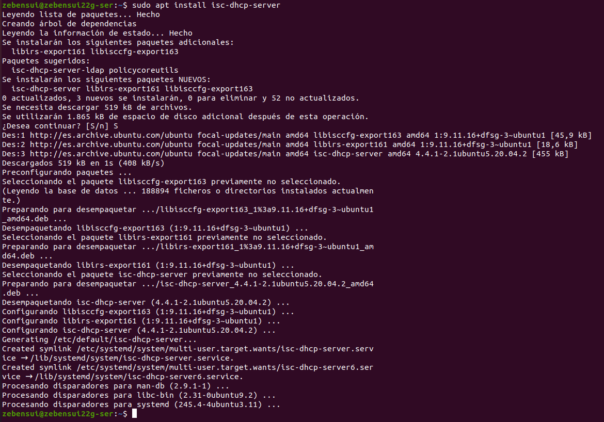

2. Ahora tenemos que ir a modificar el fichero de configuración del servicio, que es dhcpd.conf y se encuentra en /etc/dhcp.

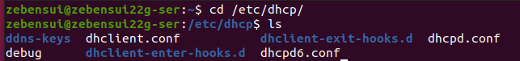

3. Una vez dentro nos vamos a encontrar todas las lineas comentadas, osea que no tienen efecto ninguno. Lo que vamos hacer es ir a la linea comentada que empieza por subnet y aquí es donde vamos a empezar a configurar el ámbito de la siguiente forma: en la primera que pone subnet introducimos la IP de la red y su mascara correspondiente, en la siguiente tenemos que poner el rango de IPs que queremos que suministre el ambito, en las tres siguientes ponemos la IP del servidor DNS , el nombre y la puerta de enlace en ese orden, en la siguiente ponemos la IP de broadcast que es la última de la red y los dos últimos parámetros los puedes dejar como están.

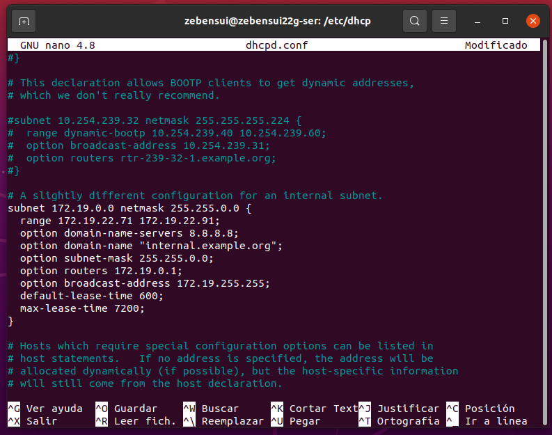

4. Tenemos que asignarle esta confgiuración a una tarjeta de red, para ello nos vamos a modificar el archivo isc-dhcp-server que esta en la ruta /etc/default

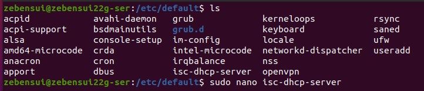

5. Una vez dentro solo tenemos que poner el nombre de nuestro adaptador de red.

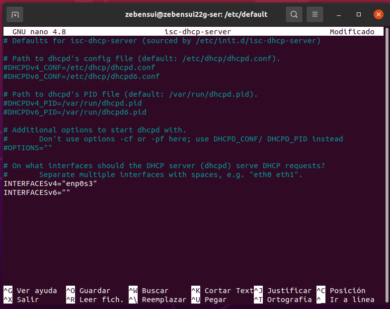

6. Antes de comprobar tenemos que resetear el servicio y comprobar que funciona bien.

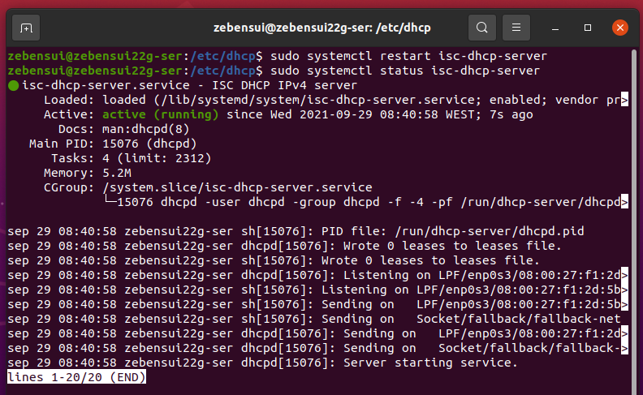

7. Nos vamos al cliente, ponemos la configuración de red en DHCP y nos tiene que dar una IP del rango que configuramos en el ámbito, seguramente sea la primera.

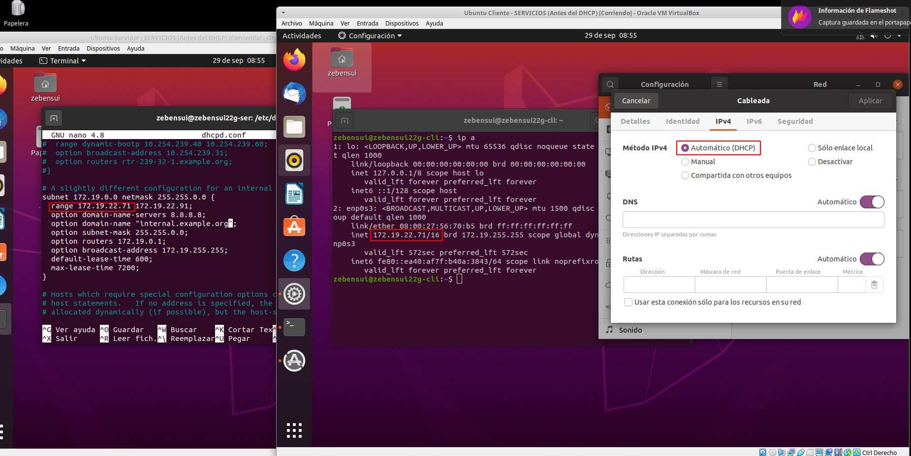

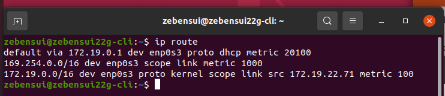

8. Ahora vamos a crear una reserva. Primero necesitamos la MAC de la máquina.

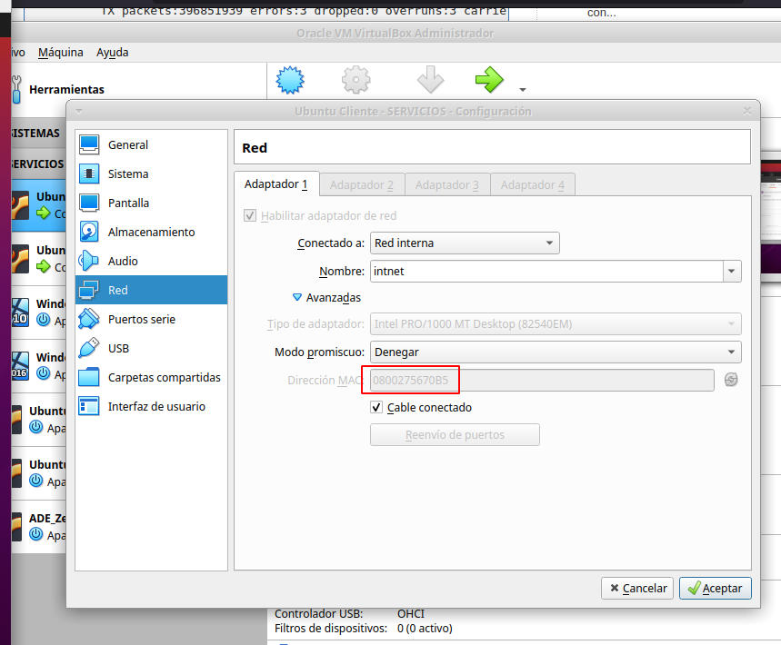

9. Nos tenemos que ir otra vez al archivo dhcpd.conf y un poco más abajo de donde configuramos antes el ámbito, nos vamos a encontrar la linea comentada host fantasía. La descomentamos, ponemos el nombre del equipo justo al lado y dentro de los paréntesis tenemos que poner en la primera linea nuestra MAC y en la segunda la IP que queremos darle.

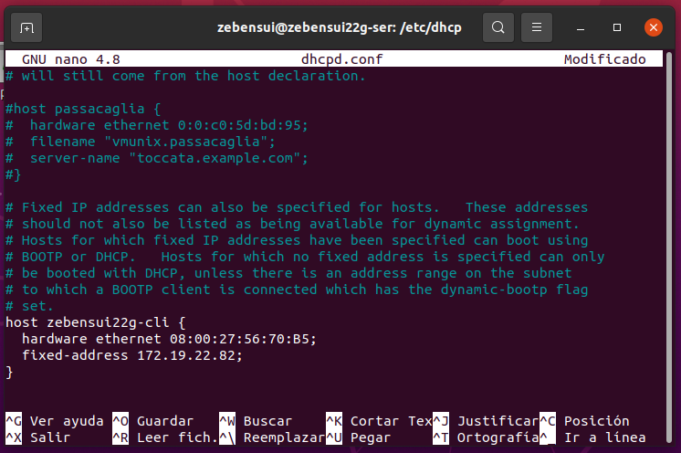

10. Ahora vamos al cliente y lo comprobamos como antes.

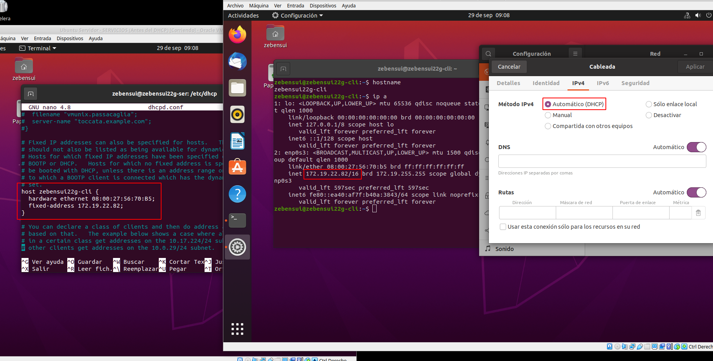

11. Ahora solo nos queda excluir una IP, para esto lo que tenemos que hacer es hacer dos rangos de IPs excluyendo la que no queremos que suministre, en mi caso quería quitarle la que reservamos antes, por tanto tuve que comentar la reserva que hice y poner dos rangos que tuvieran todas las IPs que quería menos la 82

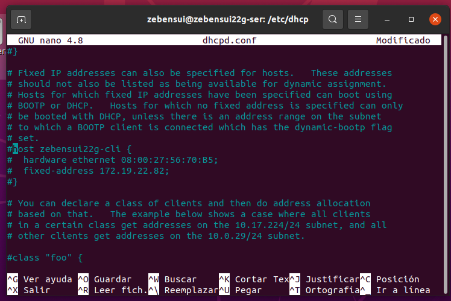

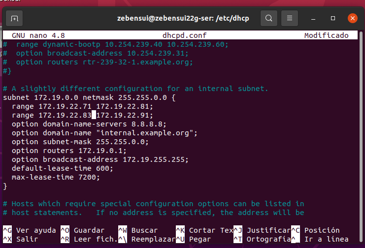

12. Ahora vamos una vez más al cliente y lo comprobamos.

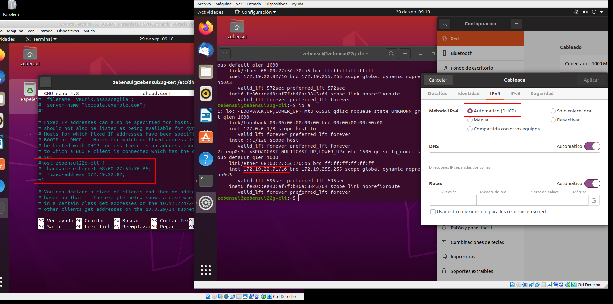
