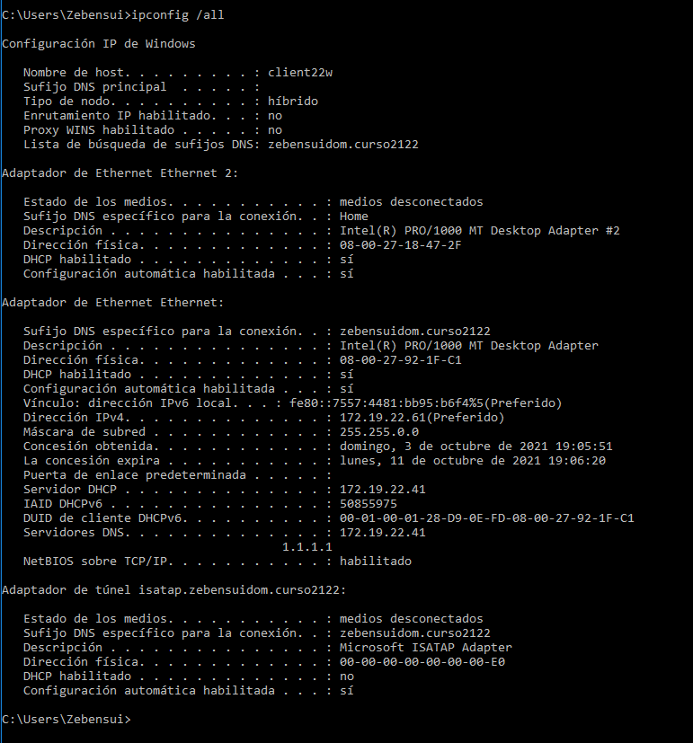

## Informe DHCP Failover - Zebensui Lorenzo Esquivel

Lo que vamos a configurar en este caso es el DHCP Failover, que es tener dos servidores DHCP por si uno se cae que el otro siga suministrando IPs dentro de ese ámbito

Lo primero que tenemos que hacer es comprobar que los dos servidores se comunican entre ellos.

Una vez hecho esto tenemos que meter al servidor secundario en le dominio del primario.

Ahora creamos el Ámbito dentro del servidor principal. No me voy a parar a explicar esto porque lo hemos visto en otras prácticas.

Ahora ya si vamos a configurar el Failover. Para ello le damos click derecho dentro del ámbito y seleccionamos "Conmutador por error" Una vez dentro lo primero que tenemos que seleccionar es la red sobre la que queramos configurarlo.

Lo siguiente es decirle cual va a ser nuestro servidor secundario, para ello escribimos su nombre completo y si tienen conexión entre ellos y están en el mismo dominio debería de encontrarlo al instante.

Solo nos queda configurar el nombre y el tiempo que tiene que pasar desde que se cae uno hasta que el otro server empieza a suministrar las IPs, en mi caso puse una hora porque me despiste pero luego lo cambie.

Con esto ya solo nos queda confirma todo e irnos al secundario para ver que también se creo el ambito y se configuró el Failover.

En mi caso quería cambiar el plazo de cliente porque antes me equivoque y lo que hice fue entrar en IPv4, click derecho, propiedades, conmutación por error y editar para cambiarlo

Lo único que nos queda es ir al cliente y ver que le da la IP correspondiente con le primer servidor y luego apagarlo, esperar un minuto, recargar la red y volver a comprobar que da la misma IP pero la da el servidor secundario.

