# Informe FTP - Zebensui Lorenzo Esquivel

## Windows

### Primer Sitio

1. Lo primero es instalar la función de crear sitios FTP desde el ISS.

2. Nos vamos al ISS y le damos a añadir sitio FTP para empezar a configurarlo.

3. Empezamos con la configuración poniendo el nombre del sitio y la carpeta a la que se accederá desde él.

4. Ponemos la IP y el puerto por la que se accederá al sitio y le decimos que permitimos la conexión sin certificado.

5. Le indicamos la clase de autenticación, lo usuarios que van a poder acceder y los permisos de estos.  

6. Ahora vamos a comprobar si funciona el sitio FTP.

7. Vamos a instalarnos el WinSCP que es un cliente de FTP, para comprobar que funciona desde ahí.

- Las opciones de configuración que tenemos de nuestro sitio FTP, aunque parezcan muchas no son tantas en realidad, son más o menos las mismas que podemos configurar cuando estamos creando el sitio, los usuarios que pueden acceder al sitio, el certificado SSL, el enlace con el DNS,... También tenemos cosas que no podemos cambiar desde otro sitio como la primera en la que podemos decidir que usuarios pueden o no acceder al sitio o la opción de configurar el firewall.

### Segundo Sitio

8. Vamos a por el segundo sitio que se hace igual que el primero solo que le vamos a añadir un certificado SSL.

9. Nos vamos a los usuarios del sistema para ver el grupo al que pertenecen todos los del dominio y lo agregamos.

10. Y volvemos a comprobar.

### Tercer Sitio

11. Vamos con el último que es se hace igual que los demás pero en este caso vamos a dejar que se conecten los usuarios anónimos.

**IMPORTANTE** Aunque en la captura ponga todos los Usuarios (y debería funcionar así) lo suyo es darle a Usuarios Anónimos, para que no de problemas

12. Tenemos que irnos a la carpeta que hemos puesto como directorio raíz del sitio y añadir al grupo IUSR con permisos de lectura.

13. Añadimos la IP al registro DNS con el nombre por el que queramos acceder a ella.

14. Solo nos queda comprobar

15. Para conectarte a dos sitios FTP a la vez lo único que tenemos que hacer es poner cada sitio en un puerto diferente.

## Linux

### SSH

16. Instalamos el servicio SSH y creamos los diferentes usuarios. A Jose lo metí en root y a Julia no para que tengas diferentes permisos.

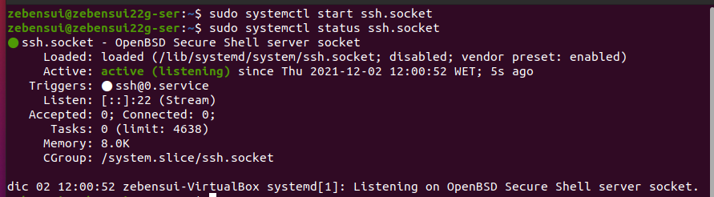

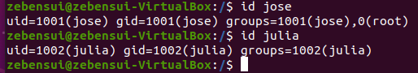

17. Comprobamos la conexión ssh.

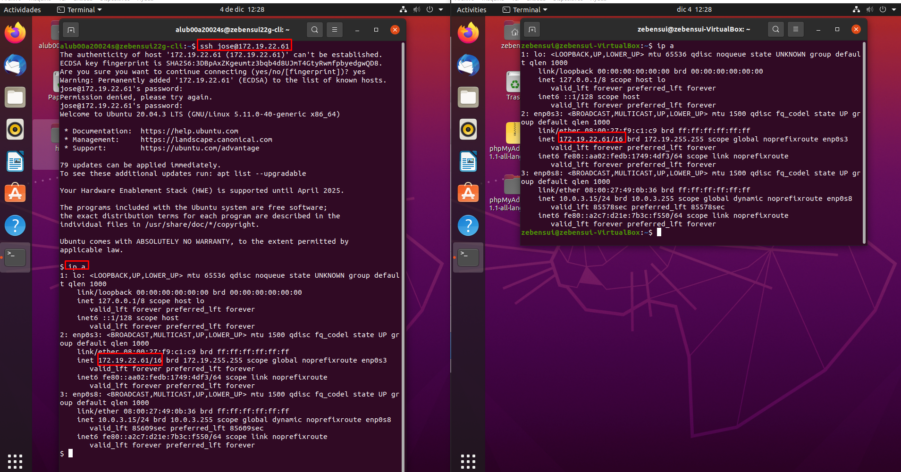

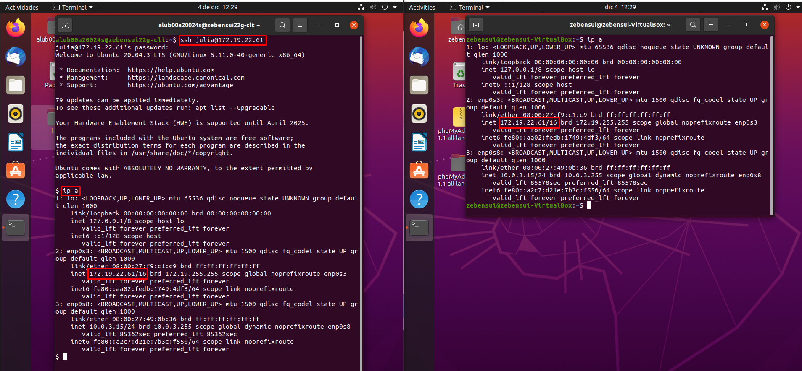

18. Ejecutamos GIMP desde el cliente entrando con los difetentes usuarios.

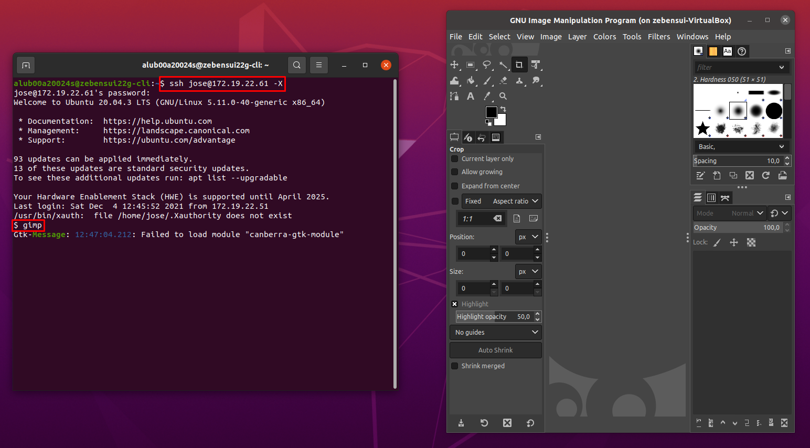

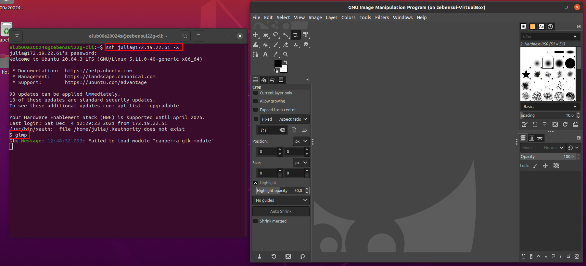

19. Ahora vamos a realizar pruebas de subida y bajada de archivos con los diferentes usuarios desde el SFTP del propio ssh

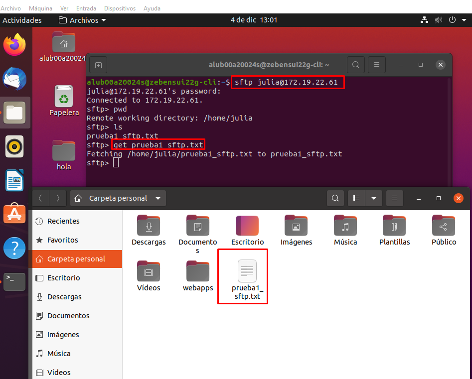

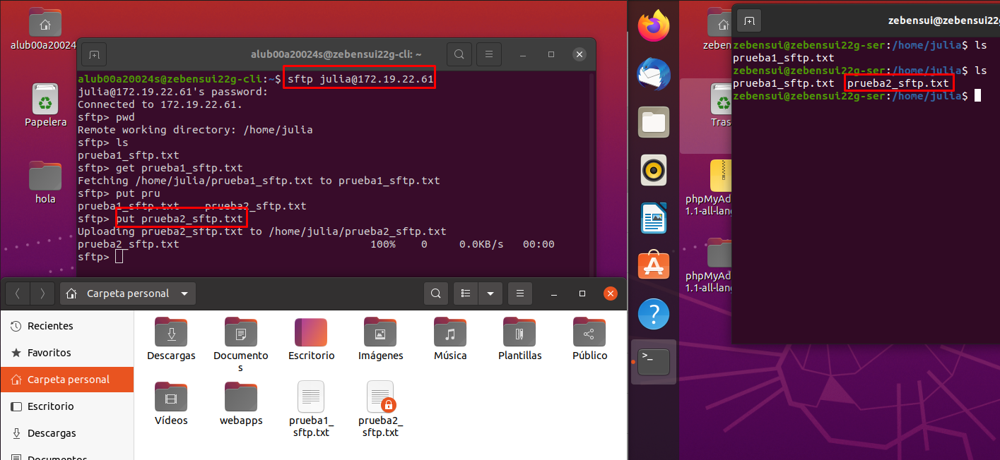

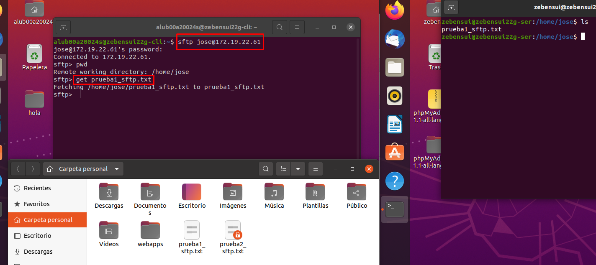

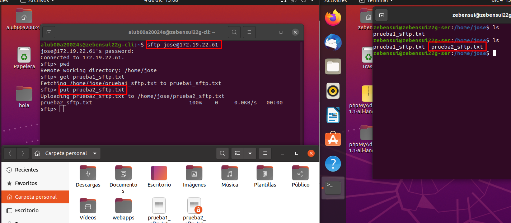

20. Enviamos una archivo al servidor con el comando scp.

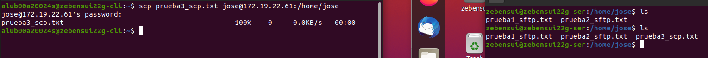

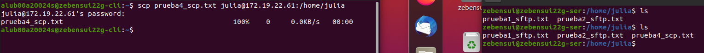

## PROFTP

21. Ahora nos instalamos el PROFTP y tenemos que ir a su archivo de configuración y descomentar la linea que se muestra a continuación:

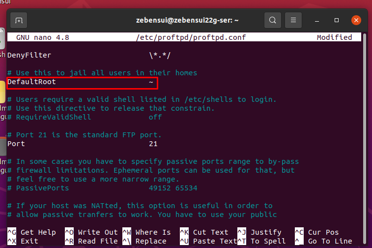

22. Comprobamos la conexión con el FTP desde el servidor y desde el cliente.

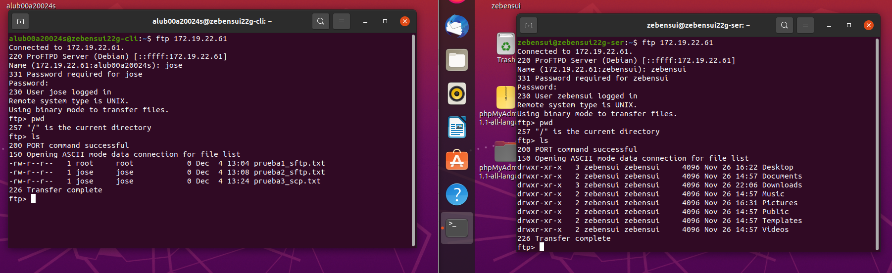

23. Ahora solo nos queda hacer las mimas pruebas que hicimos antes con el sftp pero en este caso con el PROFTP.

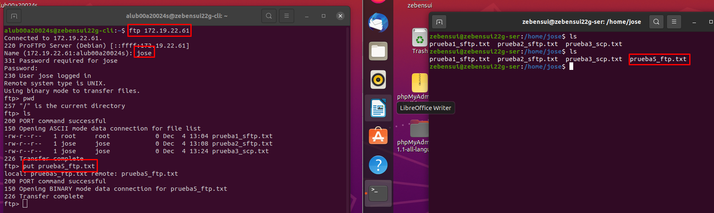

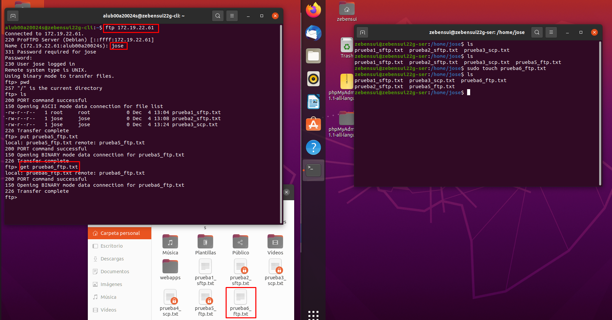

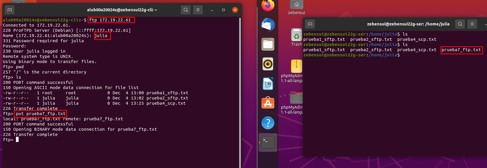

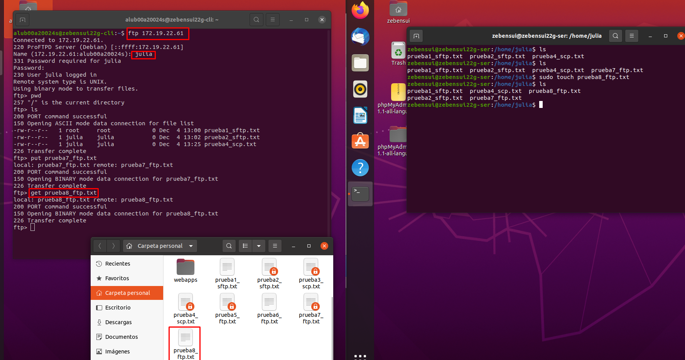
