# Servicio de Streaming en Windows 2016 - Robert Zebensui

Este servicio es muy sencillo la verdad, lo único que necesitamos es tener instalado previamente el IIS. 

Luego de haberlo instalado nos descargamos el Unreal Media server desde el sitio oficial.

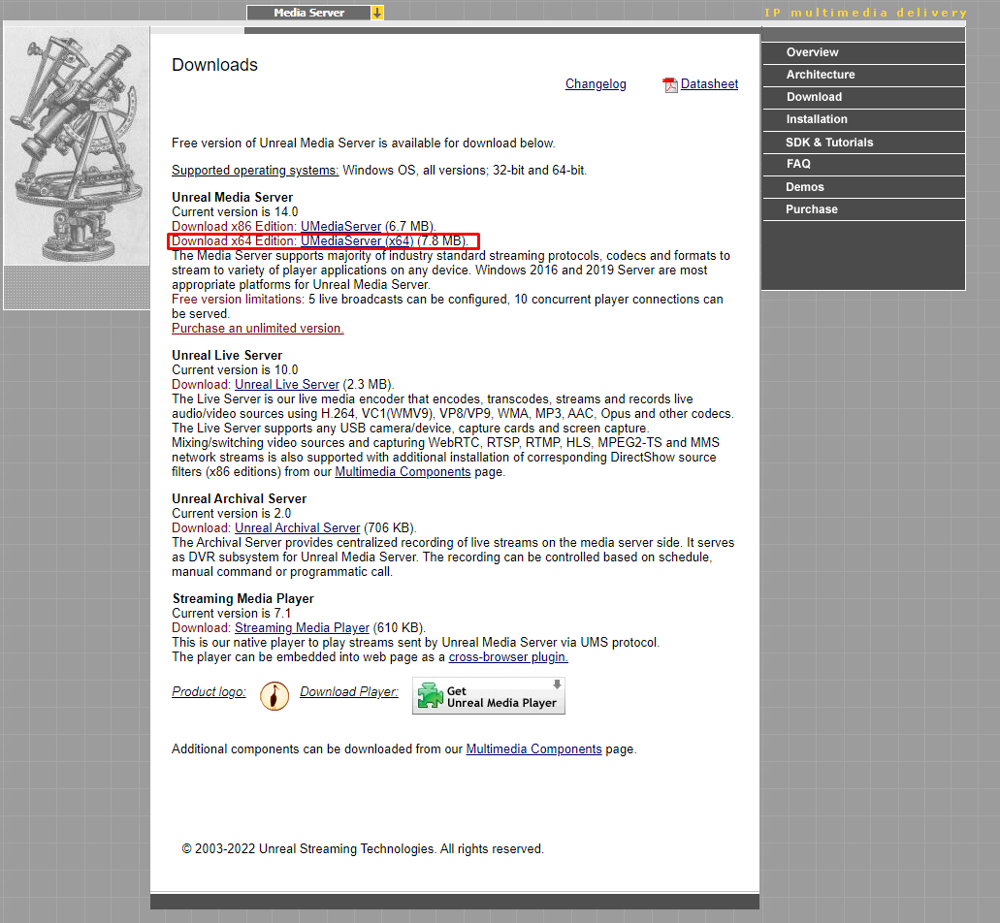

Lo descomprimimos y pasamos al proceso de instalación que es como cualquier otro, aceptar los termino y condiciones, elegir donde se instala y listo.

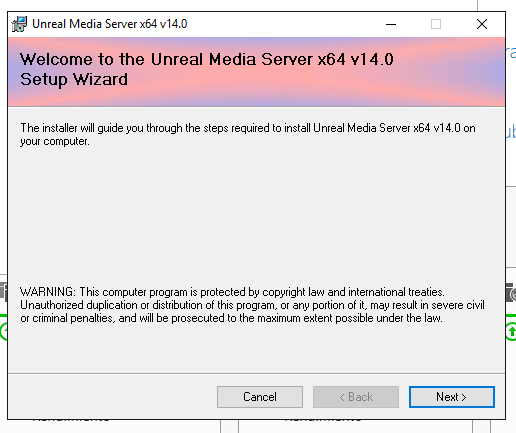

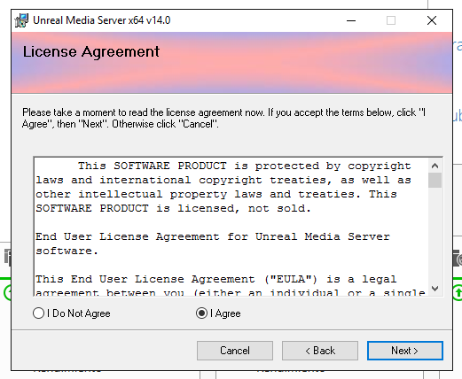

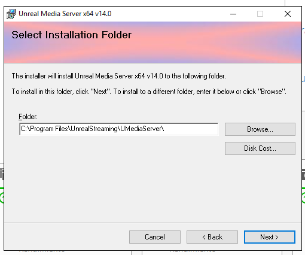

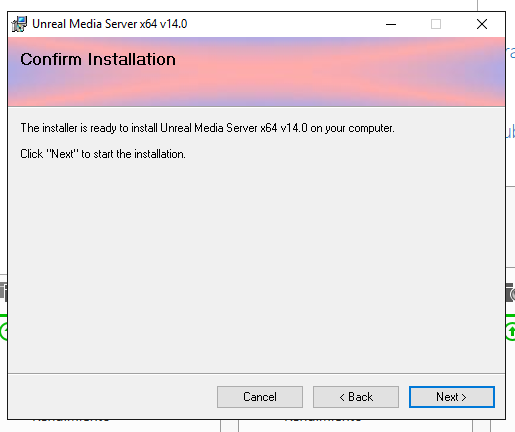

Lo abrimos y comprobamos que todo esta correcto.

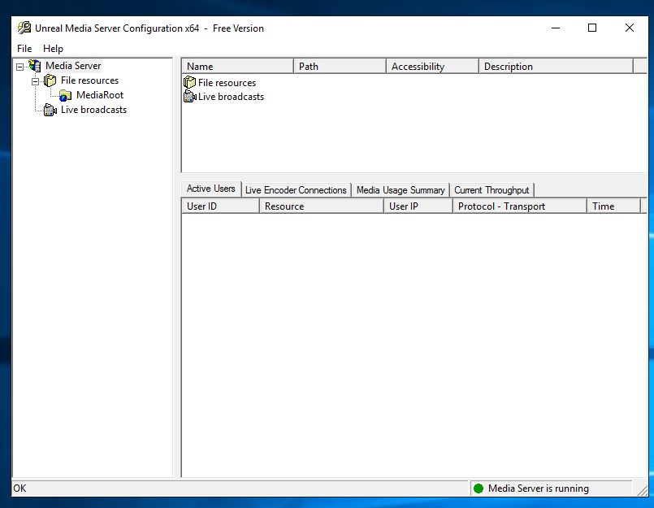

Para seguir nos aseguramos de que tenemos el Windows Media instalado.

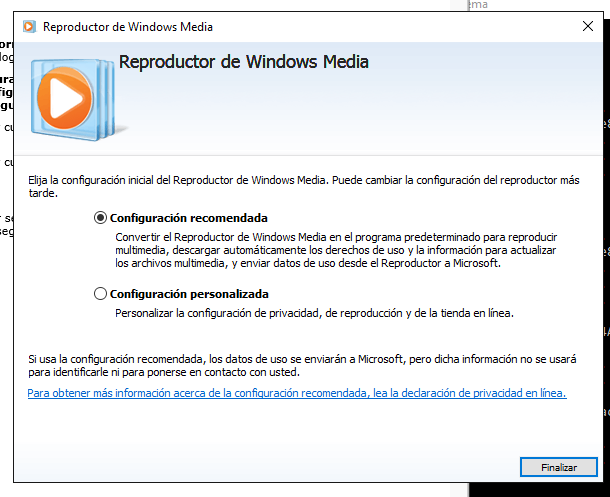

Ahora tenemos vamos a acceder al video de prueba que viene isntalado por defecto en el servicio, para ello ponemos `mms://IP_del_servidor:5119/MediaRoot/test.avi. ` en el navegador

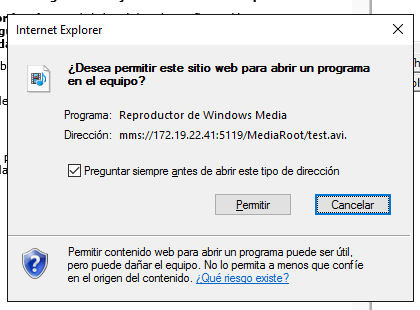

Comprobamos que funciona

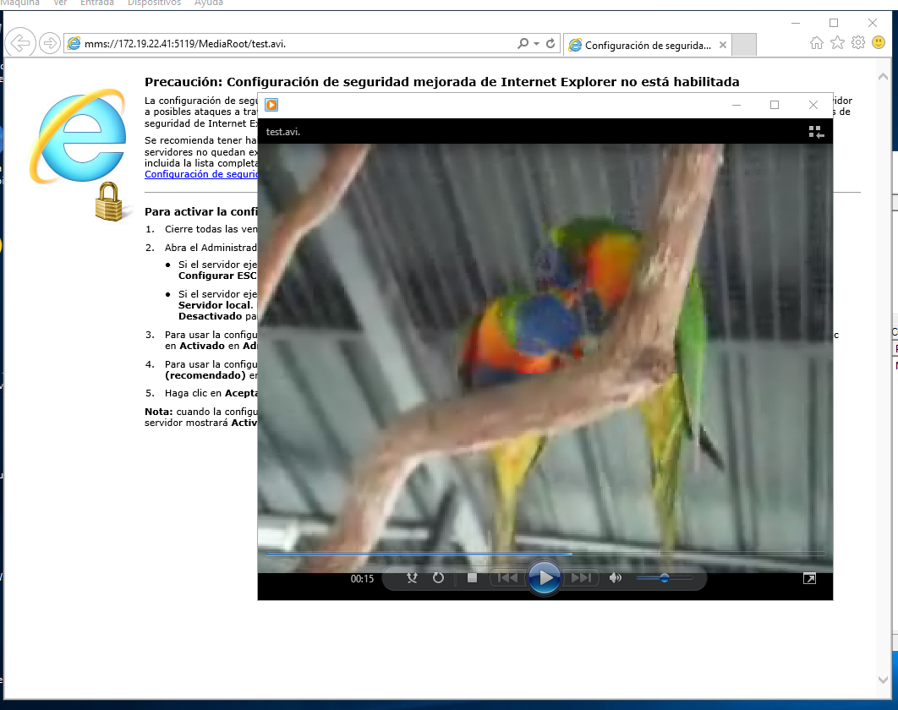

Ahora vamos a descargarnos un video nosotros para ver si funciona.

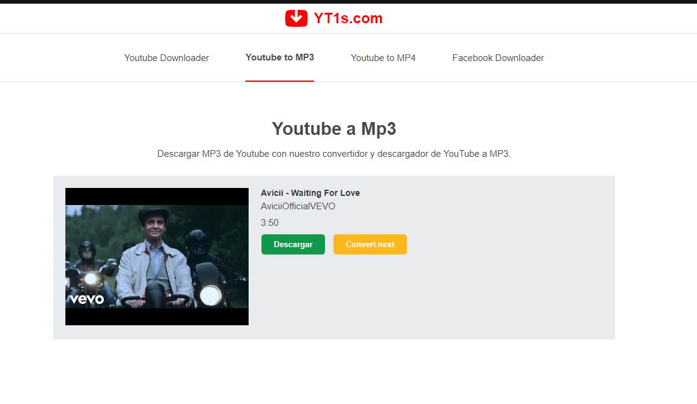

Lo añadimos al repositorio donde se almacenan los videos de este servicio.

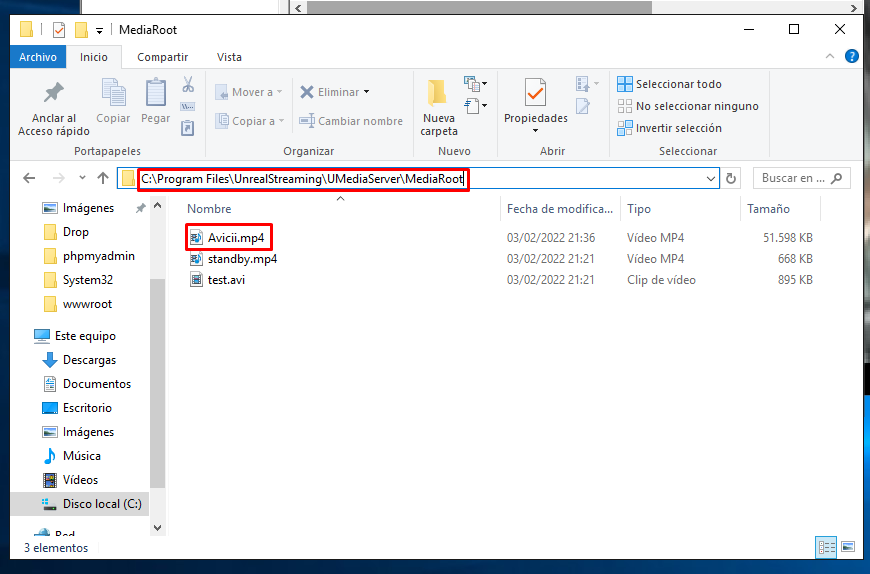

Vemos que se subió correctamente.

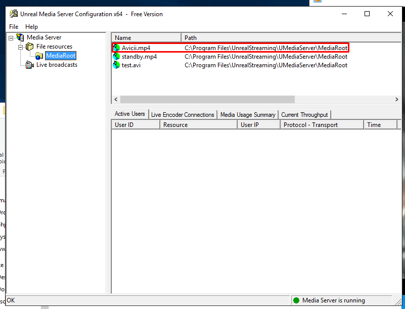

Nos vamos al navegador y ponemos lo mismo que antes pero con el nombre de este video en vez de el de prueba. 

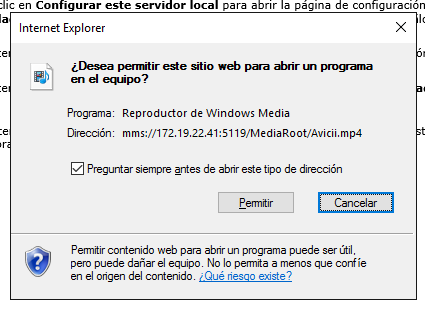

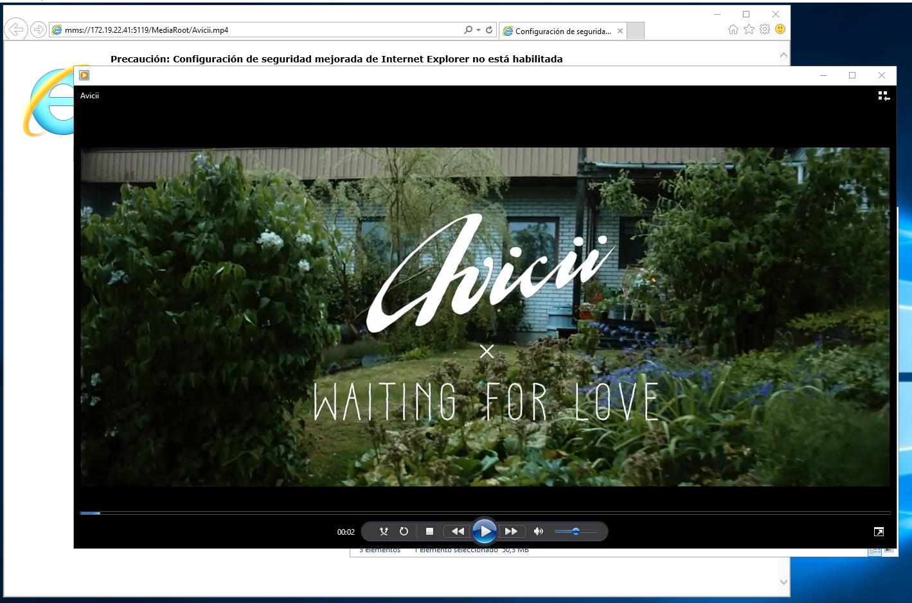