# Servicio VoIP en Linux - Robert y Zebensui

Lo primero que tenemos que hacer es descargarnos la ISO de FreePBX e instalarlo.

Seguimos los pasos de la instalación con normalidad.

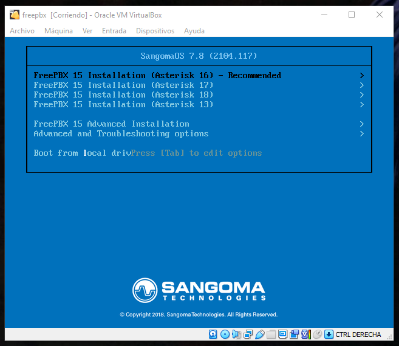

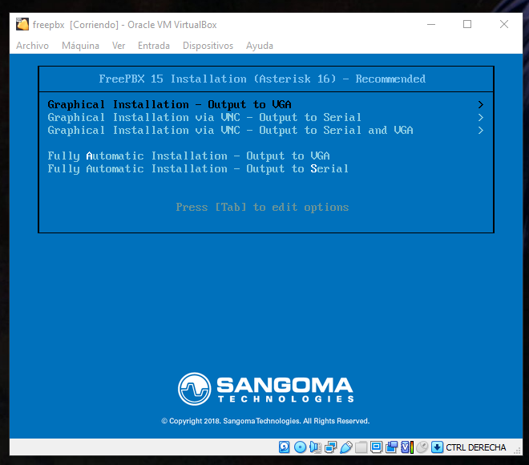

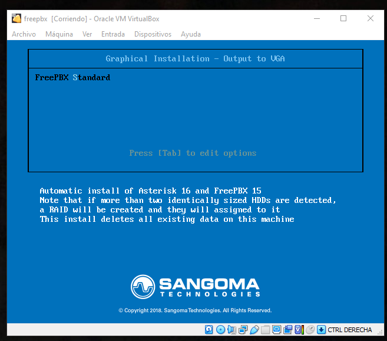

Establecemos una contraseña para la cuenta de Root

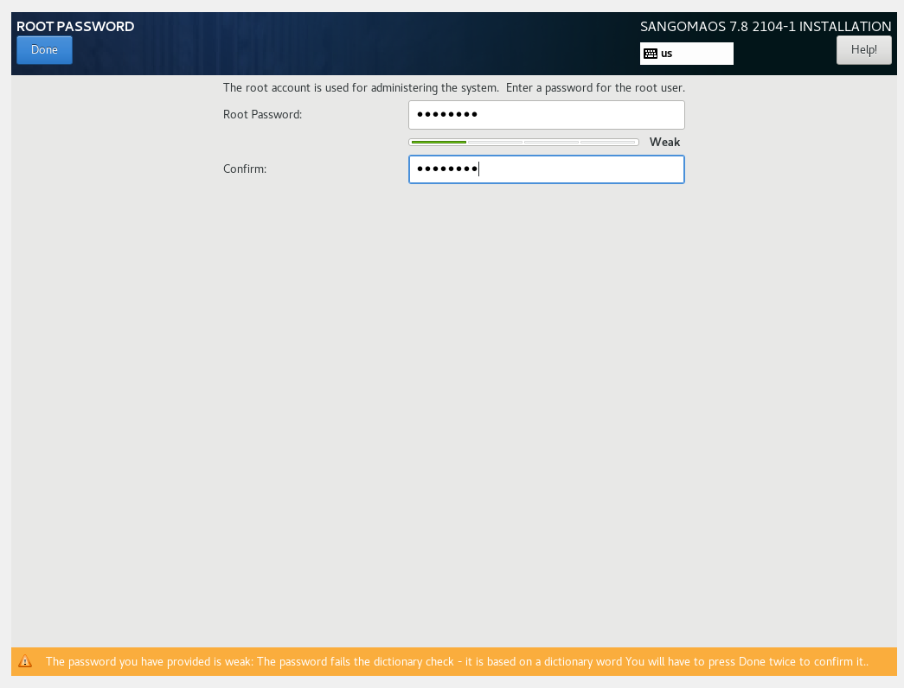

Con esto ya lo tenemos instalado.

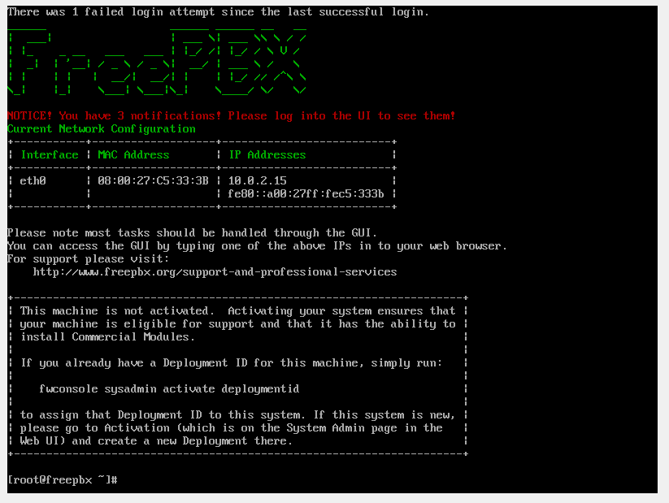

Lo siguiente es poner esta máquina en red interna con el cliente para que se comuniquen entre ellas. Luego nos vamos al navegador del cliente y ponemos la IP del FreePBX.

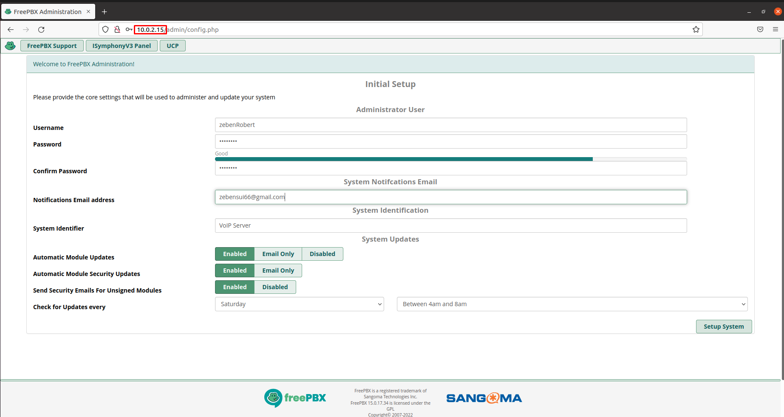

Una vez configuramos los datos necesarios, tenemos que darle a siguiente.

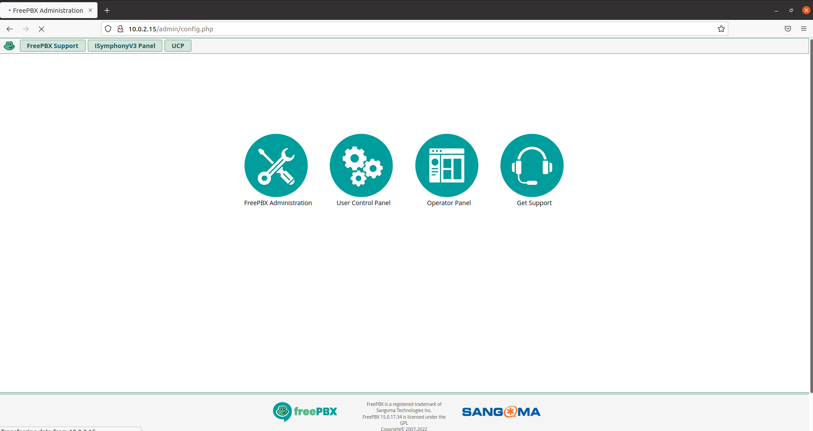

Ahora le damos a Administración para poder llegar hasta el panel de control. 

- En este proceso le damos a siguiente siempre, no debería dar problemas.

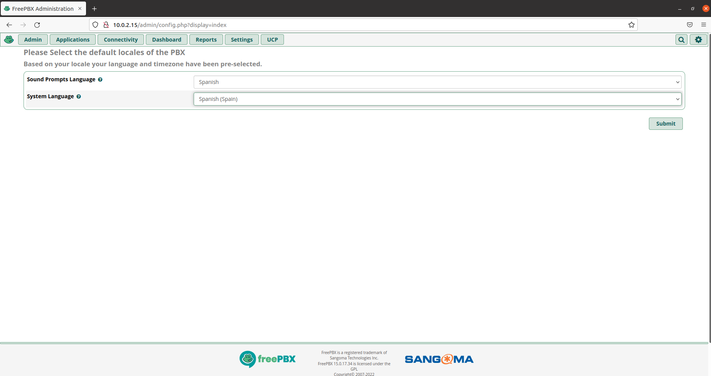

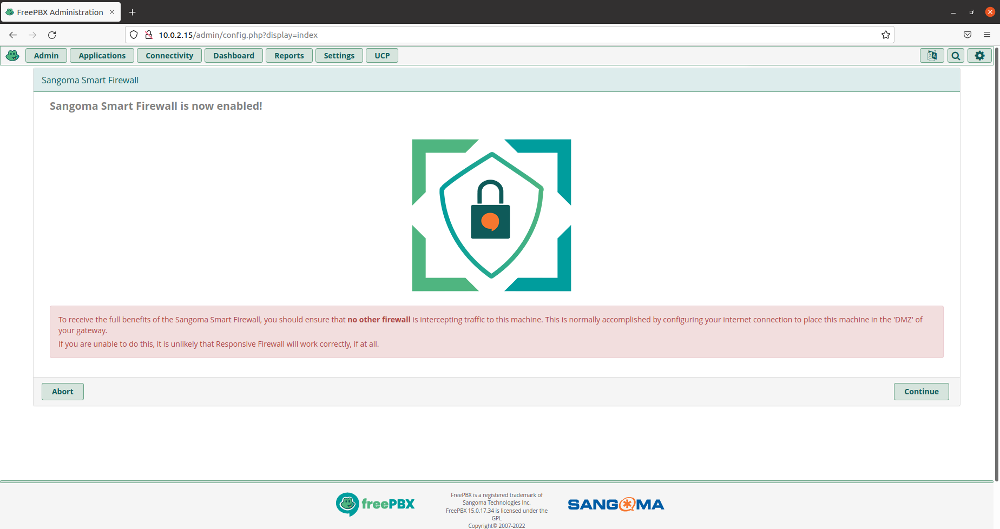

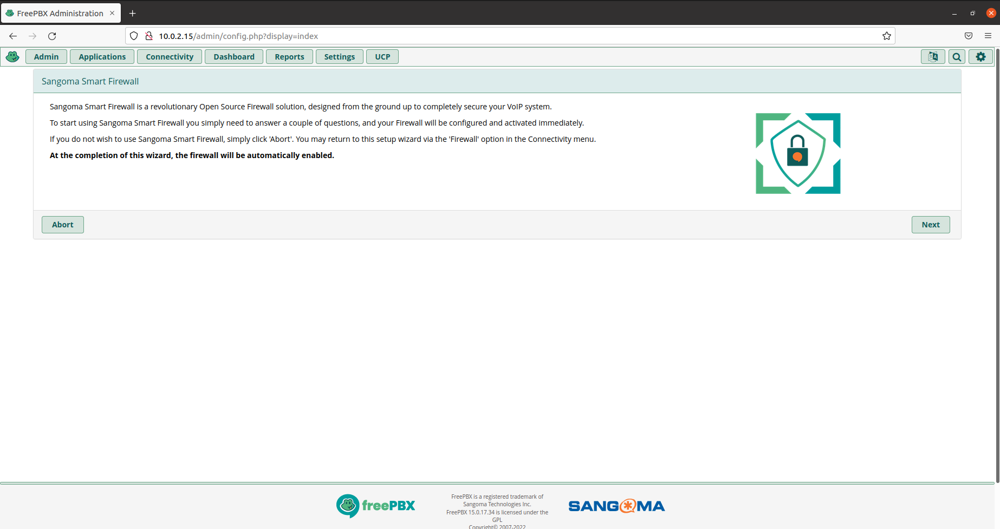

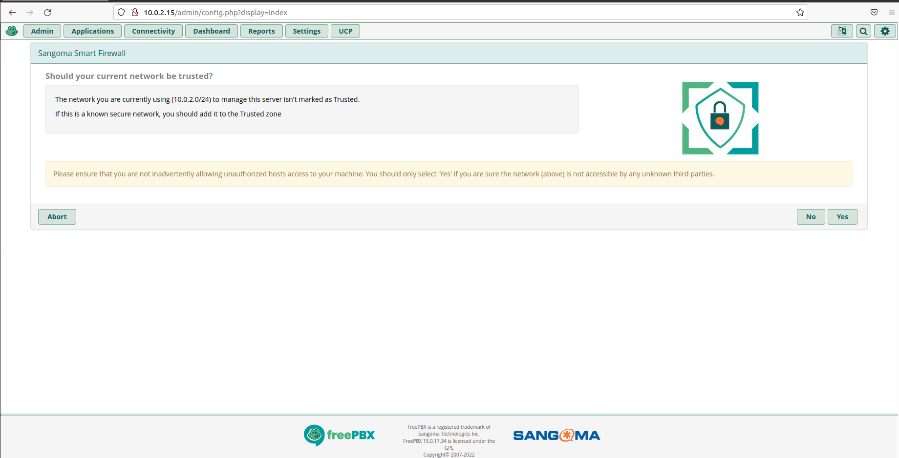

Con todo este llegaremos al panel de control por fin.

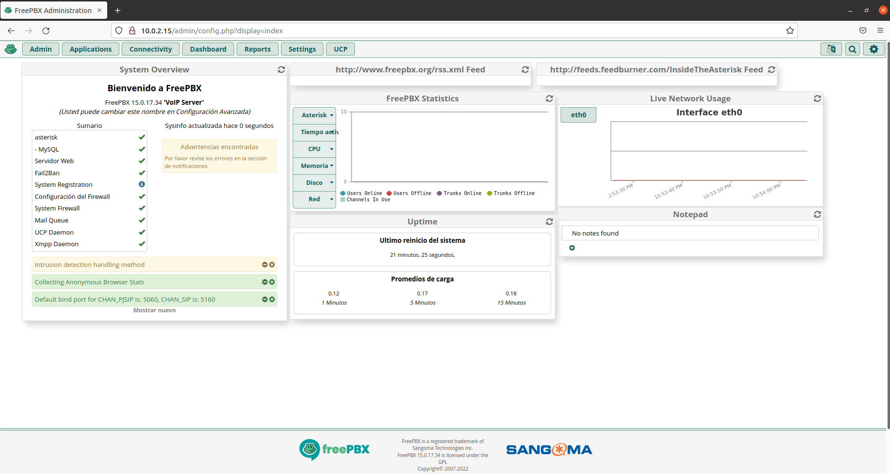

Para agregar los usuarios nos tenemos que ir a Applications > Add Extension > + Add New SIP [chan_pjsip] Extension

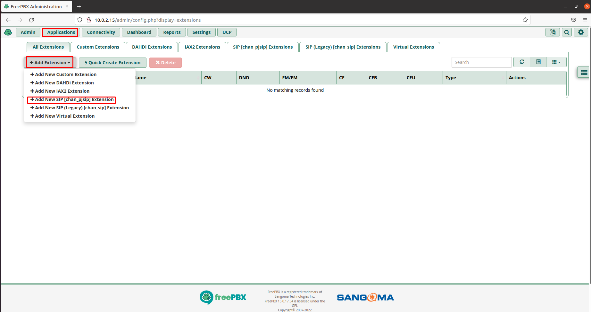

Una vez dentro solo tenemos que configurarlo tal y como se ve a continuación:

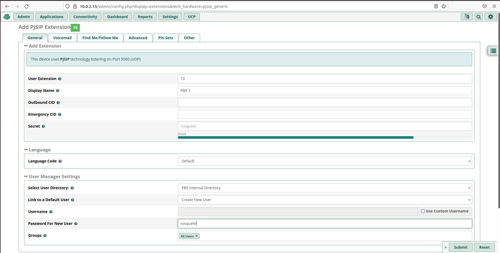

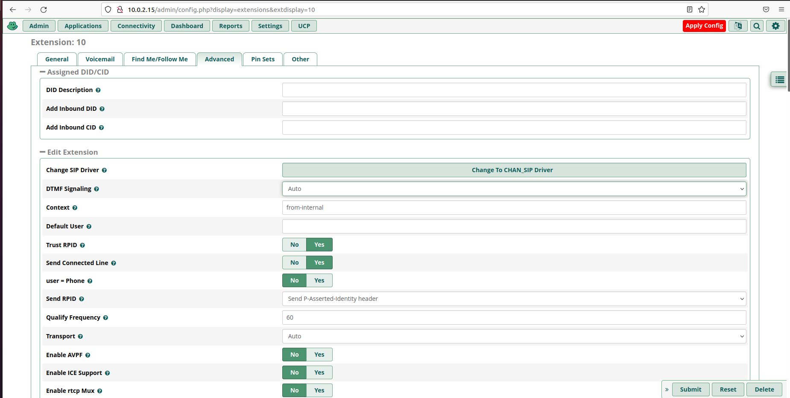

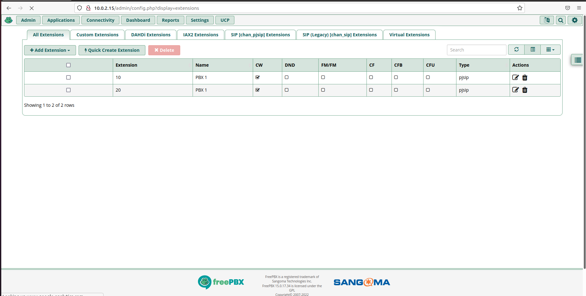

Una vez hemos creado los usuarios tenemos que descargarnos ZoiPer para ver si funciona todo correctamente.

Una vez instalado entramos con unos de los usuarios que hemos creado.

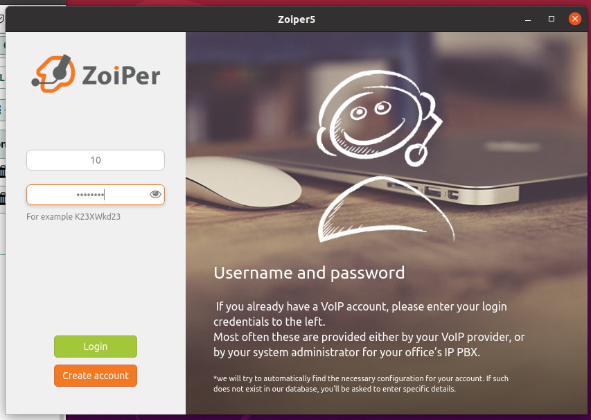

Le ponemos la dirección del servidor.

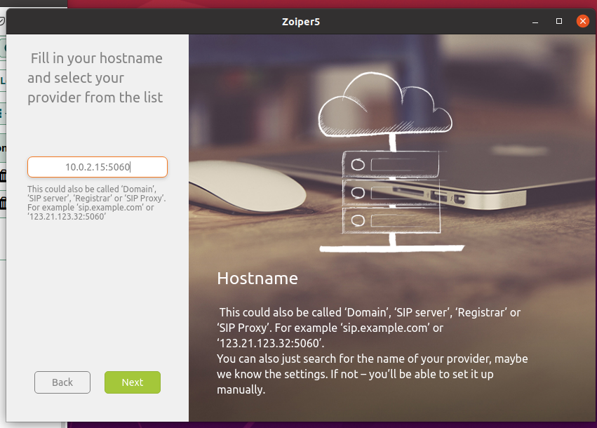

Comprobamos que funciona.

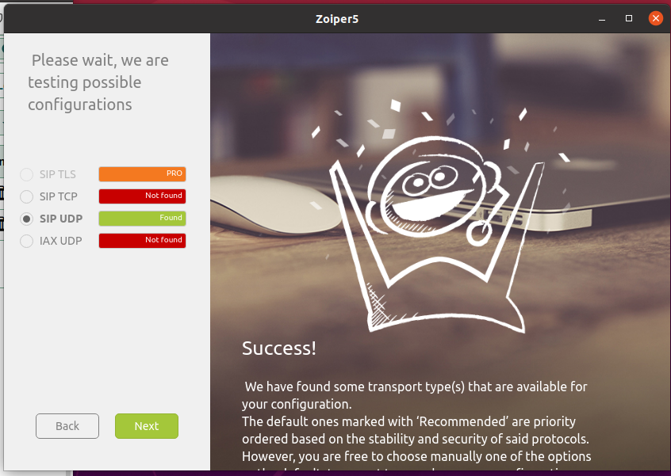

Con esto ya estamos dentro con uno de los usuarios listo para llamar y recibir llamadas.

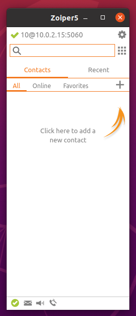

Ahora lo que tendríamos que hacer es descargar ZoiPer en el móvil, entrar con el otro usuario y establecer una llamada. 
El problema es que no conseguimos que el móvil este en la misma red que las máquinas virtuales, por mucho que ponemos estas en adaptador puente y le damos una IP de la red a la que esta conectado por WIFI el móvil, por ende es imposible que este se conecte con el cliente mediante una llamada. 

